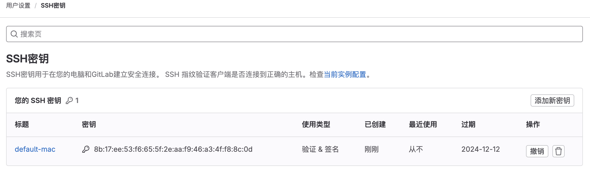
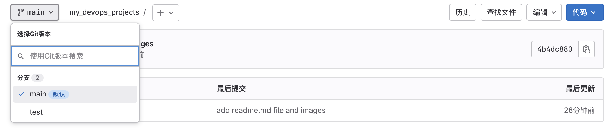
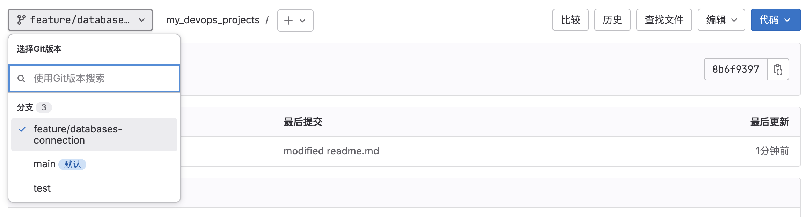

[toc]

# Version Control

Git 在软件开发中，用于管理应用程序代码

+ 版本控制概念
+ 如何实现工作
+ 创建Git仓库
+ 本地使用 Git 命令行工具
+ 所有相关的 Git 注释
+ 一些有用的概念：恢复错误，合并冲突
+ 分支的概念

🧬 贯穿整个模块，同时学习不同的概念 ，使用Git的最佳实践


#### 🤔 What is Version Control

🌰：一个团队、公司、大项目 多个开发同时在做的事情 - 开发应用程序。

+ 构建前端、后端、数据库连接等等

共享代码，多个人对同一文件做了操作，进行了更改。

从 代码仓库存储到本地，做一些改变后推送到代码仓库，下一个开发人员就可以获取到代码。

持续集成：

+ 开发中，使用相同代码的开发人员，最好的做法是不断的推拉，通常来自存储库，因此不需要合并重叠的巨大变化，也可以轻松排序不同的变化。

‼️ 如果有人弄乱了代码和更改

+ 每一次提交都是一个历史版本，可以还原提交，这就是版本控制的来源
+ 每个更改都有提示信息【意味着提交不应该很大】


#### 👀 如何实现工作

+ 远端仓库
+ 本地仓库
+ 历史：日志
+ 暂停：被锁定的部分
+ git客户端

 工作目录 --> git add  暂停区域 --> git commint  本地仓库  git pull / git push  远端仓库


#### ⚙️ 设置Git 仓库

什么是Git 存储库

+ 存储库：GitHub、GitLab
+ 私人、公司

公司不会在公共场所托管他们的代码，Git 存储库的云厂商，有自己的存储仓库托管在公司当中。

🎯 git客户端 连接 gitlab

+ 身份验证：ssh - gitlab的公钥

```sh
ssh-keygen -t rsa -b 4096 -C "baimiyishu13@163.com"
➜  ~ ls ~/.ssh/
id_rsa          id_rsa.pub
➜  ~ cat ~/.ssh/id_rsa.pub
```

 

🎯克隆仓库

+ 使用SSH克隆

```sh
git clone git@gitlab.com:baimiyishu13/my_devops_notes.git
```

因为使用SSH认证

+ GitLab 能够在拉取时进行身份认证、或推送，始终无需提供用户们和密码


#### 🎨 Git 工作

在Git工作时，了解不同的状态非常必要

本地文件  - 提交到暂存区 - commint到本地仓库 - 推送到远端

##### 🎯 git status

+ 当前目录状态

```sh
git status
On branch main
Your branch is up to date with 'origin/main'.

Changes not staged for commit:
  (use "git add <file>..." to update what will be committed)
  (use "git restore <file>..." to discard changes in working directory)
	modified:   README.md

Untracked files:
  (use "git add <file>..." to include in what will be committed)
	.DS_Store
	images/
	main.md

no changes added to commit (use "git add" and/or "git commit -a")
```

+ 未暂存的更改（Untracked files）：这些是在工作目录中但尚未被Git跟踪的文件。
+ 已修改但未暂存的更改（Changes not staged for commit）：这些是在工作目录中已被Git跟踪但尚未被暂存的文件更改。
+ 已暂存的更改（Changes to be committed）：这些是已经暂存但尚未提交的文件更改。

🔔 如果想最后再提交（推送）可以先讲文件存储在 暂存区


##### 🎯 git add

将工作目录中的文件更改添加到暂存区

```sh
➜  my_devops_notes git:(main) ✗ git add README.md
➜  my_devops_notes git:(main) ✗ git status
On branch main
Your branch is up to date with 'origin/main'.

Changes to be committed:
  (use "git restore --staged <file>..." to unstage)
	modified:   README.md
```

git add 用法：【. | file | dir/ | 正则】


##### 🎯 git commit

将暂存区中的更改提交到版本库中，并创建一个新的提交（commit）

+ 这个提交包含了您在暂存区中添加的文件更改的快照。

🔔 如果省略 `-m` 选项，Git 会打开默认文本编辑器（通常是 Vi 或 Nano），以便输入提交信息

```sh
➜  my_devops_notes git:(main) ✗ git commit
[main 2ebc8f2] Add README.md File
 1 file changed, 28 insertions(+), 75 deletions(-)
```


##### 🎯 git log

显示您仓库中的提交记录，包括每个提交的作者、提交时间、提交消息以及哈希值

```sh
commit 2ebc8f26c8753cc0e4cd3a1347abcc845080dc78 (HEAD -> main)
Author: baimiyishu13 <baimiyishu13@163.com>
Date:   Wed Dec 13 21:58:01 2023 +0800

    Add README.md File

commit b4701a6a867ba0f09fe61c475a5af079d2031d75 (origin/main, origin/HEAD)
Author: baimiyishu13 <baimiyishu13@163.com>
Date:   Wed Dec 13 12:06:39 2023 +0000

    Initial commit
```


##### 🎯 git push

将本地分支的更改推送到远程仓库

```sh
git push 仓库名称 分支
---
➜  my_devops_notes git:(main) ✗ git push
Enumerating objects: 5, done.
Counting objects: 100% (5/5), done.
Delta compression using up to 8 threads
Compressing objects: 100% (2/2), done.
Writing objects: 100% (3/3), 925 bytes | 925.00 KiB/s, done.
Total 3 (delta 0), reused 0 (delta 0), pack-reused 0
To gitlab.com:baimiyishu13/my_devops_notes.git
   b4701a6..2ebc8f2  main -> main
```


#### 🧩 初始化本地仓库

假设创建了一些代码，并且想检查推送，而并非克隆现有的

+ 创建本地存储库 - 推送到远程

在某时刻想将本地私人代码项目托管在 远端Git仓库

```sh
➜  my_devops_projects ls -a
.         ..        README.md images
```

##### 🎯 git init

转换成本地仓库

```sh
➜  my_devops_projects git init
Initialized empty Git repository in /Users/lelema/Documents/my_devops_projects/.git/
➜  my_devops_projects git:(main) ✗ git status
On branch main

No commits yet

Untracked files:
  (use "git add <file>..." to include in what will be committed)
	README.md

nothing added to commit but untracked files present (use "git add" to track)
```

添加到暂存区 - 更改提交到版本库中

```sh
➜  my_devops_projects git:(main) ✗ git add .
➜  my_devops_projects git:(main) ✗ git status
On branch main

No commits yet

Changes to be committed:
  (use "git rm --cached <file>..." to unstage)
	new file:   README.md
➜  my_devops_projects git:(main) ✗  git commit -m 'add readme.md file and images'
[main (root-commit) 4b4dc88] add readme.md file and images
 1 file changed, 58 insertions(+)
 create mode 100644 README.md 
```


但此时，对存储库一无所知【远端】

##### 🎯 git remote add

将远程仓库添加到本地的 Git 仓库

前提：gitlab创建一个空项目 my_devops_projects

```
git remote add origin git@gitlab.com:baimiyishu13/my_devops_projects.git
git push --set-upstream origin main
```

+ 将本地的 `main` 分支推送到远程仓库 `origin`


#### 🦠 分支

如果在开发持续集成持续交付的管道，那么应该始终使用 main 分支，还将出发测试代码的管道

##### 🎯 cretae

开发中典型的案例，为程序开发新功能 或者 修改功能中的错误

‼️每个开发都更改了代码，如果都推送到存储库，那会是多混乱

所以：存在分支的概念

1. 为了干净利落的分工
2. 最佳实践：每个功能进行分支【功能分支、错误分支等等】
3. 合并到主分支

  

也可以起

+ bugfix/user-auth-err 等再好不过，清晰的分离

在不破坏其他人的代码情况下，本地完成修改和测试后，将它合并到主分支

🔔  如果合并的文件大，很可能出现冲突

+ 开发将不得不去沟通解决


让本地知道创建了一个新分支

```sh
➜  my_devops_projects git:(main) git pull
From gitlab.com:baimiyishu13/my_devops_projects
 * [new branch]      test       -> origin/test
```


##### 🎯 git checkout 

等同：git switch

切换分支：

```sh
git checkout test
---
➜  my_devops_projects git:(main) git checkout test
branch 'test' set up to track 'origin/test'.
Switched to a new branch 'test'
➜  my_devops_projects git:(test)
```

+ 现在的修改只会影响该分支下的代码


  创建并切换到新分支

+ 无需在UI界面创建，本地更快的完成

```sh
git checkout -b feature/databases-connection
---
➜  my_devops_projects git:(main) git checkout -b feature/databases-connection
Switched to a new branch 'feature/databases-connection'
➜  my_devops_projects git:(feature/databases-connection)
```


##### 🎯 git branch

查看所有分支

```sh
git branch
---
➜  my_devops_projects git:(feature/databases-connection) git branch
* feature/databases-connection
  main
  test
```

在新的分支中修改了README.md文件

```sh
vim README.md
git status
git add .
git commit -m "modified readme.md"
git push
git push --set-upstream origin feature/databases-connection
```

 


#### 🏆 合并请求

使用git处理代码时常见的一种做法，当开发人员完成功能实现 或者 错误修复其他开发人员审查更改 直到合并到 mian 

+ main 是必须受到保护的