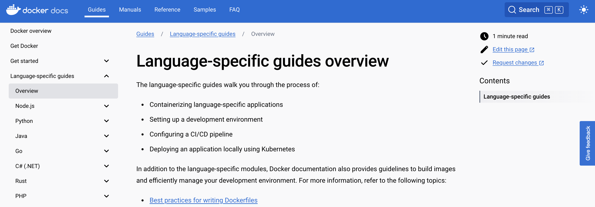

## 🏆 Build & Package Manager Tools

[toc]

#### 🚀  Databases

🎯 数据库如何融入整体软件开发过程 

例：用户通过UI提交信息，存储在数据库中，也可以从数据库中提取

开发选择 【取决场景】

1. 本地安装数据库【不会弄乱影响其他开发】所以基本每个开发都有自己的本地数据库
2. 托管的数据库


🎯 如何连接到数据库

+ 每一种编程语言都有雨数据库连接的库

所以开发都会使用一些库的代码来连接数据库，但是必须告诉：

+ 使用的是哪个数据库
+ 数据库凭证

> 一切都在代码中的样子

python为例子：

```python
import mysql.connector

# 设置数据库连接信息
config = {
    'user': 'your_username',
    'password': 'your_password',
    'host': 'localhost',
    'database': 'your_database',
    'port': '3306'
}

# 创建数据库连接
connection = mysql.connector.connect(**config)

# 关闭连接
connection.close()
```

最佳实践是使用 “环境变量”，所以可以在外部配置。

+ 切换数据库也不需要更改密码

也可以当作启动命令传入【命令行参数】


🧡最佳方法：配置文件


#### 🚀  Databases Types

不同类型的数据库

1. MySQL
2. PostgreSQL
3. MongoDB
4. Redis
5. Elasticsearch

等等

为什么需要这么多数据库，它们的区别是什么，以及应用程序该选择哪一种

##### 🎯 key value databases

+ Redis
+ Etcd

这些数据库非常快

例如：kubernetes etcd数据库，实时存储集群信息数据【每一个小变化都会在etcd中更新 】

##### 🎯 文档数据库

+ MongoDB

非结构化数据，不需要在之前建立架构 

##### 🎯 关系型数据库

+ MySQL
+ PostgreSQL 

一个结构数据库，不能用它来存储结构化数据，需要严格的模式，数据被组织 成表

+ 所以写入如何东西前都需要建立架构
+ 属性、数据类型、大小等等
+ 可选还是必选

##### 🎯 搜索引擎数据库

+ ElasticSearch

---

#### 🤔 What is Build & Package Manager Tools

构建和管理包：应用程序构建过程中的一部分

+ 即使是开发工程师的东西，也应该了解
+ 这些工具在软件开发中的作用

总体概述和比较，而不是深入研究这些工具和技术


当完成项目应用程序实现，该程序必须是可用的，所以需要部署 

+ 如何移动代码和所有依赖到服务器上运行
+ 将应用程序打包在一个可移动的文件

building the code：

1. 编译应用程序代码
2. 压缩代码

编译工具取决于开发使用的语言

 


#### 🚀 构建过程

无论使用什么技术，这个过程都是相似的

将其推送到存储库

理解两个概念很重要

1. 包管理器：Docker
2. 构建工具：CICD管道和构建自动化


#### 🚀 Build Tools & Docker

使用Docker见变得更加容易

+ 简单的将所有内容 copy 到docker镜像中，甚至不需要压缩
+ 不再需要安装依赖项在服务器


#### 🚀 Build Tools & DevOps

为什么devops需要学习构建工具和理解概念

开发者完成开发后会在本地运行应用程序工具，甚至可以在本地测试

他们使用：

+ 依赖文件
+ 构建工具

所以devops并不会在这个域内做太多事情，但是应该协助他们关于命令和配置工具的构建

因为作为Devops，更清楚应用程序将在哪里运行，以及如何在环境中运行

构建镜像 - push 到仓库 -发布到服务器都不会是在开发的电脑上实现。

+ 这一切都发生在构建工具中 【Jenkins】这是Devops的职责【构建自动化和CICD管道】

例如：在Jenkins上构建应用程序，其中包含：

1. 安装依赖项 针对应用程序的代码进行测试
2. 然后构建或绑定应用程序代码
3. 推送到 存储库，并将其部署到服务器

🔔 运行程序是开发在自己电脑上执行，并非在构建工具中执行


CICD

1. 需要在构建上执行程序测试
2. 打包到镜像中

