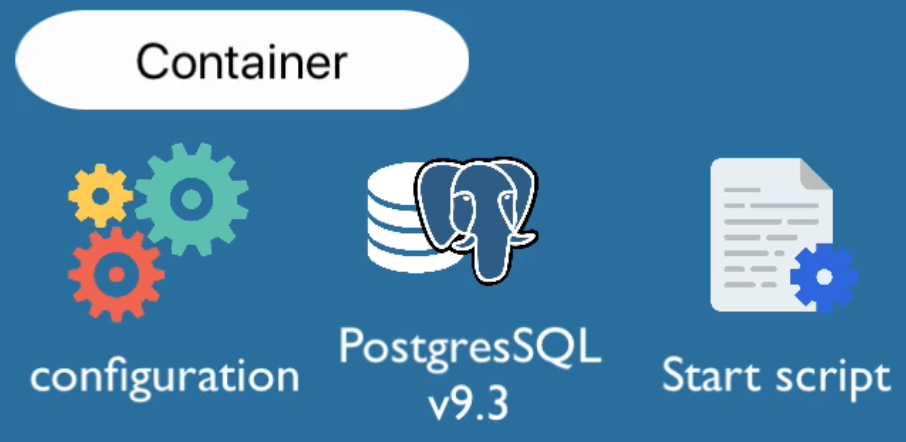

## 🏆 Containers with Docker

[toc]

1. what is containers
2. docker image
3. docker vs VM
4. docker commands
5. dvelop woth  docker 
6. Docker Compose
7. Dockerfile
8. Push Docker repository
9. Deployment 
10. volume

#### 🚀 what is containers

+ 以及解决了什么？
+ 如何使得开发过程更容易、更高效？
+ 如何解决在部署中的问题？

##### 🎯 containers ？

容器是一种打包应用程序的方式，在容器内有需要的一切

+ 依赖项
+ 所有必要的配置文件

便携的：轻松的共享和移动，可移植性高，一切都打包在一个隔离环境中，赋予了一些优势

+ 开发和部署过程更加高效

##### 🎯 repository

存储仓库

+ 私有
+ 公有 DockerHub

可以推送所有容器镜像到仓库

##### 🎯 改进开发过程

容器之前的开发过程：

+ 不得不在本季安装依赖等应用程序 

容器开发：

+ 不必在本机系统安装如何服务，因为容器是自己隔离工作的 【特点版本 - 所有配置 - 启动脚本等等】

 

Devops 唯一需要做的可能就是：安装服务器Containers？运行docker images

#### 🚀 containers vs image

 在技术上讲：containers 是由镜像组成的，所以有

+ 相互叠加的镜像层
+ Linux Base image ， Linux不同发型版本的镜像
+ 应用程序image

> 如何容器 image都是由层来组成的

image：实际上就是包，连同代码、配置文件、依赖等等

容器：本地拉取image 运行

