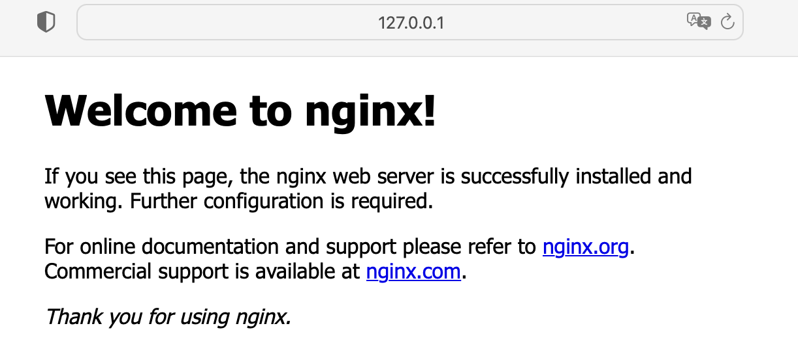
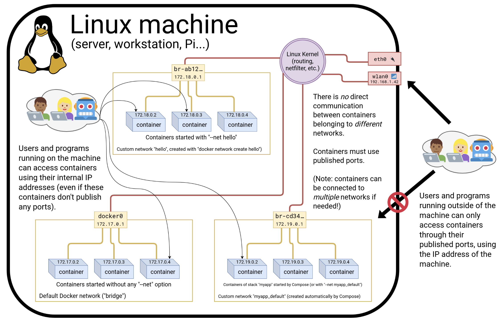

## 🏆 Containers with Docker

🚀 简介

+ 最初编写此内容是为了记录自己学习 Docker 笔记
+ 这些材料内容参考了 jerome Petazzoni 大师和其他 Docker 教学贡献者的视频
+ 按照自己的步调去学习，这里将包含尽可能全的内容

建议：花一些时间阅读 Docker 或者在其他渠道系统学习

## 🌐 目录

[toc]

## 阶段一：

### ⛳️ 学习环境

本地安装 Docker 【99.99% 的docker 都在linux上，推荐使用 远程Linux】

+ 安装 docker【Mac】 ：https://docs.docker.com/desktop/install/mac-install/

```sh
$ docker -v
Docker version 23.0.5, build bc4487a
```

当然也可以 云虚拟机上安装 Docker

如果是linux

+ 登录后，确保可以运行基本的 Docker 命令：

```sh
$ docker version
Client:
	...
Server:
	...
```

当说运行docker 安装docker时，到底是什么意思？

🚀 What is Docker

+ 安装docker 实际上意味着：“安装docker 引擎 和 CLI”
+ Docker 引擎：一个守护进程（在后台运行），负责管理容器【就像 VM的管理程序管理 VM一样】
+ 使用Docker CLI 和 Docker引擎 通过API通信 【还有许多其他程序也通过该API】


### ⛳️ 第一个容器

目标

+ 看到 Docker 的实际应用
+ 启动你的第一个容器

🚀 非常简单的容器

只需运行该命令：

+ 使用了现有的最小、最简单的 image 之一：`busybox`
+ 运行了一个进程并 echo `hello world`

```sh
$ docker run busybox echo hello world
Unable to find image 'busybox:latest' locally
latest: Pulling from library/busybox
29f4353257d6: Pull complete
Digest: sha256:ba76950ac9eaa407512c9d859cea48114eeff8a6f12ebaa5d32ce79d4a017dd8
Status: Downloaded newer image for busybox:latest
hello world
```

如果 Docker 安装是全新的，还会看到一些额外的行，对于镜像的下载`busybox`

再次运行：【不再需要下载】

```sh
$ docker run busybox echo hello world
hello world
```

镜像：

```sh
$ docker images
REPOSITORY   TAG       IMAGE ID       CREATED       SIZE
busybox      latest    23466caa55cb   4 days ago    4.04MB
```


🚀 更有用的容器

运行容器：

```sh
$ sh docker run -it ubuntu
```

+ 运行一个简单的`ubuntu`系统
+ -it`是 的简写`-i -t
  + `-i`告诉 Docker 将连接到容器的标准输入。【input / output】
  + `-t`告诉 Docker 需要一个伪终端。【terminal】

镜像大小：

```sh
$ docker images
REPOSITORY   TAG       IMAGE ID       CREATED       SIZE
ubuntu       latest    da935f064913   10 days ago   69.3MB
```

尝试在的容器中运行`figlet`

```sh
apt-get update
apt-get install figlet
```

一分钟后，`figlet`安装完毕！

```sh
root@792c40d4a504:/# figlet Hello
 _   _      _ _
| | | | ___| | | ___
| |_| |/ _ \ | |/ _ \
|  _  |  __/ | | (_) |
|_| |_|\___|_|_|\___/
```

像平常一样，通过注销 shell 来退出容器。

+ （例如用`^D`或`exit`）

🔔 主机和容器是独立的东西，在主机上安装某些东西不会将其暴露给容器，反之亦然。

+ 可以重复 花时间定制的容器，这不是 Docker 的默认工作流程
+ 如果需要在容器中安装某些东西，请构建自定义镜像
+ 看起来很复杂其实非常简单【非常强调自动化和可重复性】

🎯 如果启动一个新容器并尝试`figlet`？

```sh
$ docker run -it ubuntu
root@b13c164401fb:/# figlet
bash: figlet: command not found
```

+ 启动了一个*全新的容器*。
+ 使用了基本的 Ubuntu 镜像，`figlet`此处不提供。


🚀 VM vs Docker 开发环境

🎯 本地开发环境

当使用本地虚拟机（例如 VirtualBox 或 VMware）时，的工作流程如下所示：

- 从基本模板创建虚拟机（Ubuntu、CentOS...）
- 安装包，设置环境
- 从事项目工作
- 完成后，关闭虚拟机
- 下次需要处理项目时，按照离开时的方式重新启动虚拟机

随着时间的推移，虚拟机配置会不断发展、出现差异，没有一种干净、可靠、确定的方式来提供该环境。


🎯 使用 Docker 进行本地开发

使用 Docker，工作流程如下所示：

- 使用的开发环境创建容器镜像
- 使用该镜像运行容器
- 从事项目工作
- 完成后，关闭容器
- 下次需要处理项目时，启动一个新容器
- 如果需要调整环境，创建一个新镜像

对的环境有清晰的定义，并且可以可靠地与他人共享。


### ⛳️ 容器背景

的第一个容器是*交互式的*。

现在将了解如何：

- 运行非交互式容器。
- 在后台运行容器。
- 列出正在运行的容器。
- 检查容器的日志。
- 停止一个容器。
- 列出已停止的容器


🚀 非交互式容器

将运行一个小型自定义容器。【该容器仅显示每秒的时间】

```dockerfile
FROM alpine:latest
CMD ["sh", "-c", "while true; do date; sleep 1; done"]
```

这个容器将永远运行。要停止它，按`^C`

```sh
$ docker run clock
Sat Dec 23 06:34:15 UTC 2023
Sat Dec 23 06:34:16 UTC 2023
```

执行按`^C` 会发生：

`SIGINT`被发送到容器，这意味着：`SIGINT`被发送到 PID 1（默认情况）

- `SIGINT`运行时被发送到*前台进程*`-ti`

但 PID 1 有一个特殊情况：它忽略所有信号！

- 除了`SIGKILL`和`SIGSTOP`
- 除了显式处理的信号

🔔有很多情况`^C`不会停止容器。【docker kill】


🚀 在后台运行容器

容器可以在后台启动，带有`-d`标志（守护进程模式）：

```sh
$ docker run -d clock
4e795afdea6d5d83930bbc3d0109b6dbbf589195069ed30020963a8d55742da8
```

- 看不到容器的输出,但Docker 为提供了容器的 ID。


🚀 查看容器

`docker ps` 就像Linux `ps`命令一样，使用 列出正在运行的进程。

```sh
$ docker ps
CONTAINER ID   IMAGE     COMMAND                   CREATED              STATUS              PORTS     NAMES
4e795afdea6d   clock     "sh -c 'while true; …"   About a minute ago   Up About a minute             condescending_curran
```

- 容器的ID
- 用于启动容器的镜像
- 容器已经运行 ( `Up`) 几分钟了
- 其他信息（COMMAND、PORTS、NAMES）

🤔 当许多容器已在运行时，仅查看最后启动的容器可能会很有用

+ 这可以通过（“Last”）标志来实现`-l`：

```sh
$ docker ps -l
```


🎯 只查看容器的ID

```sh
docker ps -q
```

+ 列出所有状态的容器的容器ID `-aq`


🚀 容器日志 

Docker 正在记录容器输出

```sh
$ docker logs 4e7
```

- 指定了容器 ID 的*前缀、当然，可以指定完整的 ID。
- 该`logs`命令将输出容器的 *完整日志。*（有时，这会太多。让看看如何解决这个问题。）

为了避免被十一个页面的输出垃圾邮件，可以使用以下

+ `--tail`选项
+ `-f`，可以跟踪容器的日志（这将显示日志文件中的最后一行。然后，它将继续实时显示日志）


🚀 停止容器

可以通过两种方式终止分离的容器。

- 使用命令杀死它`docker kill`。【通过使用信号立即停止容器】
- 使用命令停止它`docker stop`。【更优雅。它发送一个`TERM`信号，10秒后，如果容器还没有停止，它发送`KILL.`】

🔔 提醒：该`KILL`信号无法被拦截，会强制终止容器

停止其中一个容器：

+ `stop`命令`kill`可以采用多个容器 ID。

```sh
$ docker stop b9
```

这将需要 10 秒：

- Docker发送TERM信号；
- 容器不会对此信号做出反应（这是一个简单的 Shell 脚本，没有特殊的信号处理）；
- 10秒后，由于容器仍在运行，Docker发送KILL信号；
- 这将终止容器。

```sh
$ docker kill 4e
```

+ 这些容器将立即终止（没有 10 秒的延迟）。


### ⛳️ 了解 Docker 镜像

- 什么是 image。
- 什么是层。

🚀 What is Image?

image = 文件+元数据

- 这些文件构成了容器的根文件系统。
- 元数据可以指示很多事情，例如 【作者信息、启动命令、环境变量等等】

镜像由层*组成，从概念上讲，镜像彼此堆叠

- 每层都可以添加、更改和删除文件和/或元数据。
- 可以共享层以优化磁盘使用、传输时间和内存使用。


🚀 镜像层

Java Web 应用程序示例

以下每一项都对应一层：

- CentOS基础OS层
- 由本地 IT 添加的包和配置文件
- JRE
- Tomcat
- 应用程序的依赖项
- 应用程序代码和包
- 应用程序配置

（注意：应用程序配置通常由编排工具添加。）

在堆叠层中，只能在最上层写入，其他层都是可读的

+ 顶层：读写层
+ 下面的层都是只读


🎯 容器和镜像的区别

- 镜像是只读文件系统。
- 容器是一组封装的进程，在该文件系统的读写副本中运行。
- 为了优化容器启动时间，使用 写时复制 而不是常规复制。
- `docker run`从给定的镜像启动一个容器。

 

🤔 如果镜像是只读的，如何更改它？

- 不去改变镜像层。
- 从该镜像创建一个新容器。
- 然后对该容器进行更改。
- 当对这些更改感到满意时，将它们转换为新层。
- 通过将新图层堆叠在旧镜像之上来创建新镜像。

👀 先有鸡还是先有蛋的问题

- 创建镜像的唯一方法是“冻结”容器。
- 创建容器的唯一方法是实例化镜像。


🎯如何搜索和下载 image 。

+ docker search、dockerhub仓库等等

🤔 image 标签以及何时使用它们 ？

+ 不指定默认：latest

⚠️：请指定标签：投入生产时，确保各处使用相同的版本，以确保以后的可重复性。


🚀 构建镜像概念

`Dockerfile`概述

- `Dockerfile`是 Docker 镜像的构建配方。
- 它包含一系列指令，告诉 Docker 如何构建镜像。
- 该`docker build`命令从`Dockerfile`.

非常简单的案例：

```dockerfile
FROM ubuntu
RUN apt-get update & apt-get install -y figlet
```

- `FROM`表示构建的基础镜像。
- 每`RUN`行都将在构建过程中由 Docker 执行。
- 的`RUN`命令**必须是非交互式的。**（构建期间无法向 Docker 提供任何输入。）
- 在许多情况下，会将`-y`标志添加到`apt-get`.

保存的文件，然后执行：

```
$ docker build -t figlet .
```

- `-t`表示要应用于镜像的标签。
- `.`*指示构建上下文*的位置。


🤔 再次运行相同的构建，它将是瞬时的。为什么？

- 在每个构建步骤之后，Docker 都会拍摄生成的镜像的快照。
- 在执行步骤之前，Docker 检查它是否已经构建了相同的序列。


🎯 sh -c

因为没有自己的解释器，而是需要外包给shell

+ 这称为*exec 语法*

执行某些操作的 Dockerfile 命令可以有两种形式：

- 纯字符串，或*shell 语法*：
  `RUN apt-get install -y figlet`
- JSON 列表，或*exec 语法*：
  `RUN ["apt-get", "install","-y","figlet"]`

Exec 语法指定要执行的*确切*命令。【要求`/bin/sh`存在于容器中】

Shell 语法指定要包装在`/bin/sh -c "..."`.

一般都使用Shell 语法，Exec语法写起来麻烦


🚀 CMD`和`ENTRYPOINT

允许设置在容器中运行的默认命令

🎯 使用cmd

的新 Dockerfile 将如下所示：

```
FROM ubuntu
RUN apt-get update
RUN ["apt-get", "install", "figlet"]
CMD figlet -f script hello
```

- `CMD`定义在未给出任何命令时运行的默认命令。
- 它可以出现在文件中的任何位置。
- 每一个 `CMD`将取代并覆盖前一个。
- 🎯因此，虽然你可以有多`CMD` ，但它是没有用的。

构建并测试

```sh
$ docker build -t hello .
$ docker run hello
 _          _   _
| |        | | | |
| |     _  | | | |  __
|/ \   |/  |/  |/  /  \_
|   |_/|__/|__/|__/\__/
```

如果想要将 shell 放入容器中,只需指定要运行的不同程序：

```sh
➜  devops_notes git:(main) ✗ docker run -ti hello sh
#
```

- 指定了`sh`.
- 它取代了 的值`CMD`。


🎯 使用`ENTRYPOINT`

的新 Dockerfile 将如下所示：

```dockerfile
FROM ubuntu
RUN apt-get update
RUN ["apt-get", "install", "figlet"]
ENTRYPOINT ["figlet", "-f", "script"]
```

- `ENTRYPOINT`为容器定义基本命令（及其参数）。
- 命令行参数将附加到这些参数中。
- 就像`CMD`,`ENTRYPOINT`可以出现在任何地方，并替换以前的值。

🤔 为什么使用 JSON 语法`ENTRYPOINT`？

- 当 CMD 或 ENTRYPOINT 使用字符串语法时，它们会被包装在`sh -c`.
- 为了避免这种包装，可以使用 JSON 语法。

如果使用`ENTRYPOINT`字符串语法怎么办：这将在镜像中运行以下命令`figlet`：

```sh
sh -c "figlet -f script" Hello
```

构建并测试

```sh
➜  devops_notes git:(main) ✗ docker run hello "HELLO DOCKER"
 ,      ___    _      _    __      ____    __    ___  ,      ___  , __
/|   | / (_)\_|_)  \_|_)  /\_\/   (|   \  /\_\/ / (_)/|   / / (_)/|/  \
 |___| \__    |      |   |    |    |    ||    ||      |__/  \__   |___/
 |   |\/     _|     _|   |    |   _|    ||    ||      | \   /     | \
 |   |/\___/(/\___/(/\___/\__/   (/\___/  \__/  \___/ |  \_/\___/ |  \_/
```


🎯 `CMD`和`ENTRYPOINT`一起使用

如果想为容器定义默认参数怎么办？将一起使用`ENTRYPOINT`和`CMD`。

- `ENTRYPOINT`将为的容器定义基本命令。
- `CMD`将定义该命令的默认参数。
- 它们*都*必须使用 JSON 语法。

的新 Dockerfile 将如下所示：

```dockerfile
FROM ubuntu
RUN apt-get update
RUN ["apt-get", "install", "figlet"]
ENTRYPOINT ["figlet", "-f", "script"]
CMD ["hello world"]
```

- `ENTRYPOINT`为容器定义基本命令（及其参数）。
- 如果在启动容器时没有指定额外的命令行参数，`CMD`则会附加 的值。
- 否则，将使用额外的命令行参数而不是`CMD`.


🧡 回顾

- `ocker run myimage`执行`ENTRYPOINT`+`CMD`
- `docker run myimage args`执行`ENTRYPOINT`+ `args`（覆盖`CMD`）
- `docker run --entrypoint prog myimage`执行`prog`（覆盖两者）


🎯何时使用`ENTRYPOINT`vs`CMD`

`ENTRYPOINT`非常适合“容器化二进制文件”。

例子：`docker run consul --help`（假装该`docker run`部分不存在！）

`CMD`非常适合具有多个二进制文件的镜像。

例子：`docker run busybox ifconfig`（表明要运行*哪个程序是有意义的！*）


###  ⛳️在构建期间复制文件

Dockerfile 关键字：`COPY`.

- 可以`COPY`递归地遍历整个目录

- 可以这样做，例如`COPY . .`

  （但可能需要一些额外的预防措施以避免复制太多）

- 在较旧的 Dockerfile 中，可能会看到以下`ADD`命令；认为它已弃用

  （类似`COPY`但可以自动提取档案）

可以创建一个名为`.dockerignore`

（在构建上下文的顶层）

- 它可以包含要忽略的文件名和全局变量

- 它们不会被发送给建筑商

  （并且不会最终出现在结果镜像中）

有关小细节请参阅[文档](https://docs.docker.com/engine/reference/builder/#dockerignore-file)


###  ⛳️ 构建镜像实验

1. 交互式：修改容器内容后使用docker commit
   + 手动过程=糟糕。
2. DockerFIle
   + 自动化流程=好。

🎉 使用 Dockerfile 构建 Docker 镜像

使用项目：[监控主机CPU内存使用率](https://gitlab.com/baimiyishu13/my_devops_notes/-/tree/main/codes/gostats_monitor?ref_type=heads)

+ 语言：Go
+ 端口：5050
+ 登陆密码：admin、admin

DockerFile文件：【多阶段构建】

```dockerfile
# 阶段1: 构建Go应用
FROM golang:1.21.1 AS builder

# 在容器中设置工作目录
WORKDIR /app

# 复制Go模块文件
COPY go.* ./

# 下载和安装依赖
RUN go mod download

# 复制整个应用程序
COPY . .

# 构建Go应用程序
RUN CGO_ENABLED=0 GOOS=linux go build -a -installsuffix cgo -o app ./src

# 阶段2: 创建最终轻量级镜像
FROM scratch

# 在容器中设置工作目录
WORKDIR /app

# 从第一个阶段复制二进制文件
COPY --from=builder /app/app .
COPY --from=builder /app/src/templates ./templates
COPY --from=builder /app/src/static ./static

# 暴露端口
EXPOSE 5050

# 运行可执行文件
CMD ["./app"]
```

构建镜像：


docker镜像

```sh
➜  gostats_monitor git:(main) ✗ docker images
REPOSITORY   TAG       IMAGE ID       CREATED          SIZE
monitor      latest    824b03a354bd   12 minutes ago   16.7MB
```

查看历史记录【镜像】

```sh
➜  gostats_monitor git:(main) ✗ docker history monitor
IMAGE          CREATED          CREATED BY                                       SIZE      COMMENT
824b03a354bd   30 minutes ago   CMD ["./app"]                                    0B        buildkit.dockerfile.v0
<missing>      30 minutes ago   EXPOSE map[5050/tcp:{}]                          0B        buildkit.dockerfile.v0
<missing>      30 minutes ago   COPY /app/src/static ./static # buildkit         2.09MB    buildkit.dockerfile.v0
<missing>      30 minutes ago   COPY /app/src/templates ./templates # buildk…   1.56kB    buildkit.dockerfile.v0
<missing>      30 minutes ago   COPY /app/app . # buildkit                       14.6MB    buildkit.dockerfile.v0
<missing>      35 minutes ago   WORKDIR /app                                     0B        buildkit.dockerfile.v0
```

运行docker镜像

```sh
➜  ~ docker run -ti -d -p 5050:5050 --name mac_monitor monitor
7d3271229b57417fb16dc60fc83073dc4e8bb720c9bf53f1189cce622904f25d
➜  ~ docker ps
CONTAINER ID   IMAGE     COMMAND   CREATED         STATUS         PORTS                    NAMES
7d3271229b57   monitor   "./app"   4 seconds ago   Up 3 seconds   0.0.0.0:5050->5050/tcp   mac_monitor
```

本地登陆访问

 


---


## 阶段二：

- [容器网络基础知识](https://2022-11-live.container.training/docker.yml.html#toc-container-networking-basics)
- [使用 Docker 进行本地开发工作流程](https://2022-11-live.container.training/docker.yml.html#toc-local-development-workflow-with-docker)
- [容器网络模型](https://2022-11-live.container.training/docker.yml.html#toc-the-container-network-model)
- [使用容器发现服务](https://2022-11-live.container.training/docker.yml.html#toc-service-discovery-with-containers)
- [为开发堆栈编写](https://2022-11-live.container.training/docker.yml.html#toc-compose-for-development-stacks)
- [练习 — 编写 Compose 文件](https://2022-11-live.container.training/docker.yml.html#toc-exercise--writing-a-compose-file)

### ⛳️ 容器网络基础知识

目标

现在将在容器中运行网络服务（接受请求）。

- 在容器中运行网络服务。
- 连接到该网络服务。
- 查找容器的 IP 地址。


运行一个静态 Web 服务器，监听端口 80 【使用官方 NGINX 镜像】

+ 提供默认的“欢迎来到 nginx！” 页

🔔 在 Docker 中，`-p` 和 `-P` 是用于端口映射的两个不同的选项

+ `-P` ： 随机端口 【然而，用于快速测试是相当常见的】
+ `-p`： 手动指定主机和容器之间的端口映射关系 【当镜像无法`EXPOSE`正确移植时】

```sh
$ docker run -d -P nginx
```

需要找到Docker使用的*端口号*（NGINX容器监听80端口，但是这个端口会被*映射*）

```sh
✗ docker ps
CONTAINER ID   IMAGE     COMMAND                   CREATED          STATUS          PORTS                    NAMES
0dfbf51ecfde   nginx     "/docker-entrypoint.…"   37 seconds ago   Up 36 seconds   0.0.0.0:55000->80/tcp    sleepy_feistel
```

另一个命令：

```sh
$ docker port 83abfb85cdae 80
0.0.0.0:5500
```


 

+ *Docker主机上的端口55000映射到容器中的端口80*

还可以`curl`直接从 Docker 主机使用

```sh
$ curl localhost:55000
```


🎯 Docker 如何知道要映射哪个端口

+ 镜像 中的元数据告诉“该镜像在端口 80 上有一些东西”。
+ 可以通过以下方式查看元数据`docker inspect`：

```sh
$ docker inspect 0df
...
	           "ExposedPorts": {
                "80/tcp": {}
            }
	"IPAddress": "172.17.0.3",
...
```

该元数据是在 Dockerfile 中使用`EXPOSE`关键字设置的。

```sh
$ docker history nginx
IMAGE          CREATED        CREATED BY                                       SIZE      COMMENT
8aea65d81da2   2 months ago   CMD ["nginx" "-g" "daemon off;"]                 0B        buildkit.dockerfile.v0
<missing>      2 months ago   STOPSIGNAL SIGQUIT                               0B        buildkit.dockerfile.v0
<missing>      2 months ago   EXPOSE map[80/tcp:{}]                            0B        buildkit.dockerfile.v0
<missing>      2 months ago   ENTRYPOINT ["/docker-entrypoint.sh"]             0B        buildkit.dockerfile.v0
...
```


🤔 将容器集成到网络中的方法有很多。

1. 启动容器，让 Docker 为其分配公共端口。然后检索该端口号并将其提供给的配置。
2. 生成配置时，请提前选择固定端口号。然后通过手动设置端口号来启动容器
3. 使用 Kubernetes 或 Swarm 等编排器。协调器将提供自己的网络设施。


可以使用`docker inspect`命令来查找容器的IP地址。

```sh
$ docker inspect --format '{{ .NetworkSettings.IPAddress }}' 83abfb85cdae
172.17.0.4
```

`docker inspect`是一个高级命令，可以检索有关容器的大量信息。

+ 可能会用于脚本中

*尝试从另一个容器*ping 的容器

```sh
$ docker run alpine ping 172.17.0.4
```


### ⛳️ 使用 Docker 进行本地开发工作流程

- 在容器和主机之间共享代码。
- 使用简单的本地开发工作流程。

主要是 `-v` : 标志将主机中的目录安装到 Docker 容器中

标志结构为：

```
[host-path]:[container-path]:[rw|ro]
```

- `[host-path]``[container-path]`如果它们不存在则创建。
- `ro`可以使用和 选项控制卷的写入状态`rw`。
- 如果不指定`rw`或`ro`，则`rw`默认为。

⚠️注意：语法`-v /path/on/host:/path/in/container`是“旧”语法

- 现代语法如下所示：

  `--mount type=bind,source=/path/on/host,target=/path/in/container`

- `--mount`更明确，但`-v`输入速度更快

- `--mount`支持所有安装类型；`-v`不支持`tmpfs`安装

- `--mount`如果主机上的路径不存在则失败；`-v`创造它

使用新语法，命令变为：

```sh
$ docker run --mount=type=bind,source=$(pwd),target=/src -dP name
```


 🤔开发工作流程回顾

1. 编写一个 Dockerfile 来构建包含的开发环境的镜像。（以及应用程序的所有依赖项）
2. 从该镜像启动一个容器。使用该`-v`标志将的源代码安装到容器内。
3. 测试应用程序。
4. 迭代并重复步骤3，直到满意为止。
5. 完成后，提交+推送源代码更改。

容器内部调试：`docker exec`


### ⛳️ 容器管理模型

了解CNM（容器网络模型）

- 为一组容器创建专用网络。
- 使用容器命名将服务连接在一起。
- 动态地将容器连接到网络和断开容器与网络的连接。
- 设置容器的IP地址。

还将解释覆盖网络和网络插件的原理。

Docker 有“网络”。

可以通过`docker network`命令来管理它们；例如：

```sh
$ docker network ls
NETWORK ID     NAME      DRIVER    SCOPE
2cdeb8bcff4d   bridge    bridge    local
4f9ceb6aa50f   host      host      local
bbd167217c0d   none      null      local
```

可以创建新的网络（使用`docker network create`）。

（注意：网络`none`和`host`是特殊的；暂时将它们放在一边。）


需要先了解一下概念：

🤔 什么是网络？

从概念上讲，Docker“网络”是一个虚拟交换机

- 默认情况下，容器连接到单个网络（但它们可以连接到零个或多个网络，甚至是动态连接）
- 每个网络都有自己的子网（IP 地址范围）
- 网络可以是本地的（对于单个 Docker 引擎）或全局的（跨多个主机）
- 容器可以具有*网络别名*，提供基于 DNS 的服务发现（每个网络都有自己的“域”、“区域”或“范围”）

🤔 服务发现

- 可以为容器指定网络别名

  （例如与`docker run --net some-network --net-alias db ...`）

- 在同一网络中运行的容器可以解析该网络别名

  （即如果他们在 上进行 DNS 查找`db`，它将给出容器的地址）

- 可以`db`在每个网络中有不同的容器

  （这可以避免不同堆栈之间的命名冲突）

- 命名容器时，它会自动将该名称添加为网络别名

  （即`docker run --name xyz ...`就像`docker run --net-alias xyz ...`

🤔 网络隔离

网络是隔离的

- 默认情况下，网络A中的容器无法访问网络B中的容器
- 连接到网络 A 和 B 的容器可以充当路由器或代理
- 始终可以通过 Docker 主机地址访问已发布的端口

 


🚀 CNM vs CNI

- CNM是Docker使用的模型

- Kubernetes 使用不同的模型，围绕 CNI 架构

  *（CNI是容器引擎和CNI插件*之间的一种API ）

Docker 模型：

- 多个隔离网络
- 每个网络的服务发现
- 网络互连需要额外的步骤

Kubernetes模型：

- 单一平面网络
- 每个命名空间的服务发现
- 网络隔离需要额外的步骤（网络策略）


🚀 创建网络

创建一个名为 的网络`dev`。

```sh
➜  ~ docker network create dev
e78fc49c6dc1b51cb8f6f1382028819a8266485fa6cffd2bc33a952a1a59ffeb
```

现在可以使用以下命令查看网络`network ls`：

```sh
➜  ~ docker network ls
NETWORK ID     NAME      DRIVER    SCOPE
2cdeb8bcff4d   bridge    bridge    local
e78fc49c6dc1   dev       bridge    local
4f9ceb6aa50f   host      host      local
bbd167217c0d   none      null      local
```

将容器放置在网络上

```sh
docker run -d --name web --net dev  nginx
```

从这个新容器中，可以使用分配的名称解析并 ping 另一个容器：

```sh
➜  ~ docker run -ti --net dev alpine sh
/ # ping web
PING web (172.18.0.3): 56 data bytes
64 bytes from 172.18.0.3: seq=0 ttl=64 time=0.865 ms

/ # nslookup web
Server:		127.0.0.11
Address:	127.0.0.11:53

Non-authoritative answer:

Non-authoritative answer:
Name:	web
Address: 172.18.0.3
```

称解析由动态解析器实现


⛳️ 使用容器发现服务

- 容器名称是唯一的（只能有一个`--name redis`）

- 网络别名不唯一

- 可以在不同的网络中使用相同的网络别名：

  ```
  docker run --net dev --net-alias redis ...
  docker run --net prod --net-alias redis ...
  ```

- 甚至可以在同一网络中拥有多个具有相同别名的容器

  （在这种情况下，会获得多个 DNS 条目，也称为“DNS 循环”）

网络和网络别名的创建通常是使用 Compose 等工具自动完成的。


🚀 网路驱动程序

- 网络由*驱动程序*管理。
- 内置驱动程序包括：
  - `bridge`（默认）
  - `none`
  - `host`
  - `macvlan`
  - `overlay`（对于 Swarm 集群）

插件可以提供更多驱动程序

overlay网络：

- 到目前为止，所看到的功能仅在所有容器都位于单个主机上时才起作用。
- 如果容器跨越多个主机，需要一个*覆盖*网络将它们连接在一起。
- Docker 附带一个默认网络插件 ，`overlay`利用 VXLAN 实现覆盖网络，并*通过 Swarm 模式启用*。
- 其他插件（Calico...）也可以提供覆盖网络。
- 一旦有了覆盖网络，所有功能就可以在多个主机上以相同的方式工作。


🚀 查看容器中的网络设置

`ifconfig`可以使用、`ip a`或 来查看网络接口列表`ip l`：

每个网络连接都通过虚拟网络接口实现。正如所看到的，可以同时连接到多个网络。


### ⛳️ Compose

Dockerfile = 非常适合构建*一个*容器镜像。

如果有多个容器怎么办？

如果其中一些需要特定`docker run`参数怎么办？

... Compose 解决了这些用例

Compose 支持简单、强大的入职工作流程：

1. 查看的代码。
2. 跑步`docker-compose up`。


一般使用流程

1. 编写 Dockerfile

2. 在名为的 YAML 文件中描述的容器堆栈`docker-compose.yml`

3. `docker-compose up`（或`docker-compose up -d`在后台运行）

4. Compose 拉取并构建所需的镜像，然后启动容器

5. Compose 显示所有容器的组合日志

   （如果在后台运行，请使用`docker-compose logs`）

6. 按 Ctrl-C 停止整个堆栈

   （如果在后台运行，请使用`docker-compose stop`）


了解即可，实际可能很少会接触

---

## 阶段三：


### ⛳️ 高效 Dockerfile 的技巧

- 减少层数。
- 利用构建缓存使构建速度更快。
- 在构建过程中嵌入单元测试。


🚀 减少层数

- 每一行`Dockerfile`都会创建一个新层。
- 构建的`Dockerfile`容器以利用 Docker 的缓存系统。
- `&&`通过使用继续命令和`\`换行来组合命令。

注意：经常会逐行构建 Dockerfile：

```sh
RUN apt-get install thisthing
RUN apt-get install andthatthing andthatotherone
RUN apt-get install somemorestuff
```

然后在发布之前对其进行简单的重构：

```sh
RUN apt-get install thisthing andthatthing andthatotherone somemorestuff
```

🍄 避免在每次构建时重新安装依赖项

- 经典的 Dockerfile 问题：

  “每次我更改一行代码，我的所有依赖项都会重新安装！”

- 解决方案：单独列出`COPY`依赖项列表（`package.json`、等），以避免每次都重新安装未更改的依赖项。`requirements.txt`

示例`Dockerfile` 【有问题的】

```sh
FROM python
WORKDIR /src
COPY . .
RUN pip install -qr requirements.txt
EXPOSE 5000
CMD ["python", "app.py"]
```

每次都会重新安装依赖项，因为构建系统不知道是否`requirements.txt`已更新。

作为单独的步骤添加依赖项意味着 Docker 可以更有效地缓存并且仅在`requirements.txt`更改时安装它们。

```sh
FROM python
WORKDIR /src
COPY requirements.txt .
RUN pip install -qr requirements.txt
COPY . .
EXPOSE 5000
CMD ["python", "app.py"]
```


🚀小心使用 `chown` `chmod` `mv`

- 层无法有效存储权限或所有权的更改。

- 层也无法有效地表示文件何时被移动。

- 因此，诸如`chown`、 、`chown`之类的操作`mv`。

- 例如，在下面的 Dockerfile 片段中，每一`RUN`行都会创建一个包含`some-file`.

  ```
  COPY some-file .
  RUN chown www-data:www-data some-file
  RUN chmod 644 some-file
  RUN mv some-file /var/www
  ```

  怎样才能避免这种情况呢？

🔔 不使用`mv`，直接将文件放在正确的位置。

🔔 在本地设置正确的权限

- 不要使用`chmod`，而是在本地设置正确的文件权限。
- 当使用 复制文件时`COPY`，权限将被保留。


🚀 何时优化镜像

在创作官方图像时，最好尽可能减少：

- 层数，
- 最终图像的大小。

这通常是以牺牲构建时间和镜像维护者的便利为代价的；但是，当图像被下载数百万次时，即使节省几秒钟的拉取时间也是值得的。


🚀 何时不优化镜像

有时，最好优先考虑*维护人员的便利性*。

特别是，如果：

- 镜像变化很大，
- 该镜像的用户很少（例如只有 1 个维护者！），
- 镜像是在同一台机器上构建和运行的，
- 该图像是在具有非常快的链接的机器上构建和运行的......

在这些情况下，只要保持简单即可！


🚀 多维版本控制系统

镜像可以有一个标签，指示的版本。

但有时，有多个重要组件，需要指明所有组件的版本。

这可以通过环境变量来完成：

```
ENV PIP=9.0.3 \
    ZC_BUILDOUT=2.11.2 \
    SETUPTOOLS=38.7.0 \
    PLONE_MAJOR=5.1 \
    PLONE_VERSION=5.1.0 \
    PLONE_MD5=76dc6cfc1c749d763c32fff3a9870d8d
```

（来源：[Plone 官方](https://github.com/plone/plone.docker/blob/master/5.1/5.1.0/alpine/Dockerfile)）


🚀 entrypoint 入口脚本

定义自定义entrypoint 是很常见的。

该入口点通常是一个脚本，执行以下操作的任意组合：

- 飞行前检查（如果所需的依赖项不可用，请尽早显示一条不错的错误消息，而不是在深层日志文件中显示晦涩难懂的错误消息），
- 配置文件的生成或验证，
- 放弃特权（例如使用`su`或`gosu`，有时与 结合使用`chown`），和更多。

（来源：[Redis 官方图片](https://github.com/docker-library/redis/blob/d24f2be82673ccef6957210cc985e392ebdc65e4/4.0/alpine/docker-entrypoint.sh)）


### ⛳️ 高级 Dockerfile 语法

`Dockerfile`使用总结

- `Dockerfile`指令按顺序执行。

- 每条指令都会在图像中创建一个新层。

- Docker 使用先前构建的各层维护一个缓存。

- 当创建层的指令和文件没有更改时，构建器会重新使用缓存的层，而不执行该层的指令。

- 该`FROM`指令必须是第一条非注释指令。

- 以 开头的行`#`被视为注释。

- 某些指令（例如`CMD`或`ENTRYPOINT`）会更新一段元数据。

  （因此，每次调用这些指令都会使前一个指令变得无用。）

#### 🚀指令`RUN`

该`RUN`指令可以通过两种方式指定。

使用 shell 包装，在 shell 内运行指定的命令，其中`/bin/sh -c`：

```
RUN apt-get update
```

或者使用该`exec`方法，它可以避免 shell 字符串扩展，并允许在没有 的图像中执行`/bin/sh`：

```
RUN [ "apt-get", "update" ]
```

🔔 `RUN`有关说明的更多信息

`RUN`将执行以下操作：

- 执行命令。
- 记录对文件系统所做的更改。
- 非常适合安装库、包和各种文件。

`RUN`不会执行以下操作：

- 记录*进程*的状态。
- 自动启动守护进程。

如果想在容器运行时自动启动某些内容，应该使用`CMD`and/or `ENTRYPOINT`。

可以在一个步骤中执行多个命令：

```
RUN apt-get update && apt-get install -y wget && apt-get clean
```

也可以将命令分成多行：

```
RUN apt-get update \
 && apt-get install -y wget \
 && apt-get clean
```


#### 🚀 指令`EXPOSE`

该`EXPOSE`指令告诉 Docker 在此镜像中要发布哪些端口。

```
EXPOSE 8080
EXPOSE 80 443
EXPOSE 53/tcp 53/udp
```

- 默认情况下，所有端口都是私有的。
- 声明一个端口并`EXPOSE`不足以将其公开。
- 它`Dockerfile`不控制服务在哪个端口上公开。

暴露端口

- 当 `docker run -p <port> ...`，该端口将变为公共。

  （即使没有用 声明`EXPOSE`。）

- 当`docker run -P ...`（没有端口号）时，声明的所有端口都`EXPOSE`将变为公共。

*公共端口*可从其他容器和主机外部访问，从外部无法访问*专用端口*。


#### 🚀 指令`COPY`

该`COPY`指令将主机中的文件和内容添加到镜像中。

```
COPY . /src
```

*这会将构建上下文*的内容（作为参数传递给 的目录）添加到 容器中的`docker build`目录中。`/src`

构建上下文隔离

注意：只能引用构建上下文*中的文件和目录。*绝对路径被视为锚定到构建上下文，因此以下两行是等效的：

```
COPY . /src
COPY / /src
```

尝试`..`退出构建上下文将被 Docker 检测到并阻止，构建将会失败。

否则，`Dockerfile`可能在主机 A 上成功，但在主机 B 上失败。

 

#### 🚀 ADD

`ADD`工作原理与 类似`COPY`，但有一些额外的功能。

`ADD`可以获取远程文件：

```
ADD http://www.example.com/webapp.jar /opt/
```

这将下载`webapp.jar`文件并将其放置在`/opt` 目录中。

`ADD`将自动解压 zip 文件和 tar 档案：

```
ADD ./assets.zip /var/www/htdocs/assets/
```

这将解压`assets.zip`成`/var/www/htdocs/assets`.

*但是，* `ADD`不会自动解压远程档案。


#### 🚀 `ADD`、`COPY`、 和构建缓存

- 在创建新层之前，Docker 检查其构建缓存。
- 对于大多数 Dockerfile 指令，Docker 仅查看 `Dockerfile`内容来进行缓存查找。
- 对于`ADD`和`COPY`说明，Docker 还会检查要添加到容器中的文件是否已更改。
- `ADD`总是需要下载远程文件才能检查它是否已更改。


#### 🚀指令`VOLUME`

该`VOLUME`指令告诉 Docker 特定的目录应该是一个*卷*。

```
VOLUME /var/lib/mysql
```

卷中的文件系统访问绕过写时复制层，为这些目录中完成的 I/O 提供本机性能。

卷可以附加到多个容器，允许将数据从一个容器“移植”到另一个容器，例如将数据库升级到较新的版本。

可以以“只读”模式启动容器。容器文件系统将变为只读，但如果需要，卷仍然可以具有读/写访问权限。


#### 🚀 指令`WORKDIR`

该`WORKDIR`指令设置后续指令的工作目录。

它还会影响`CMD`和`ENTRYPOINT`，因为它设置启动容器时使用的工作目录。

```
WORKDIR /src
```

可以`WORKDIR`再次指定更改工作目录以进行进一步的操作。


#### 🚀 指令`ENV`

该`ENV`指令指定应在从镜像启动的任何容器中设置的环境变量。

```
ENV WEBAPP_PORT 8080
```

这将导致在从此镜像创建的任何容器中创建一个环境变量

```
WEBAPP_PORT=8080
```

还可以在使用时指定环境变量`docker run`。

```
$ docker run -e WEBAPP_PORT=8000 -e WEBAPP_HOST=www.example.com ...
```


#### 🚀 指令`USER`

该`USER`指令设置运行镜像时要使用的用户名或 UID。

它可以多次使用以更改回 root 或其他用户。


#### 🚀 指令`CMD`_

该`CMD`指令是从镜像启动容器时运行的默认命令。

```
CMD [ "nginx", "-g", "daemon off;" ]
```

`nginx -g "daemon off;"`意味着在运行容器时不需要指定。

代替：

```
$ docker run <dockerhubUsername>/web_image nginx -g "daemon off;"
```

可以这样做：

```
$ docker run <dockerhubUsername>/web_image
```


就像 一样`RUN`，`CMD`指令有两种形式。第一个在 shell 中执行：

```
CMD nginx -g "daemon off;"
```

第二个直接执行，没有shell处理：

```
CMD [ "nginx", "-g", "daemon off;" ]
```


🎯 覆盖`CMD`指令

`CMD`当运行容器时可以覆盖它们。

```
$ docker run -it <dockerhubUsername>/web_image bash
```

将运行`bash`而不是`nginx -g "daemon off;"`.


#### 🚀 指令`ENTRYPOINT`

该`ENTRYPOINT`指令与指令类似`CMD`，但命令行上给出的参数会*附加*到入口点。

注意：必须使用“exec”语法（`[ "..." ]`）。

```
ENTRYPOINT [ "/bin/ls" ]
```

如果要运行：

```
$ docker run training/ls -l
```

`-l`容器将运行，而不是尝试运行`/bin/ls -l`。


🎯  `CMD`及`ENTRYPOINT`互动

和说明`CMD`一起`ENTRYPOINT`使用时效果最佳。

```
ENTRYPOINT [ "nginx" ]
CMD [ "-g", "daemon off;" ]
```

指定`ENTRYPOINT`要运行的命令并`CMD` 指定其选项。然后，可以在需要时在命令行上覆盖这些选项。

```
$ docker run -d <dockerhubUsername>/web_image -t
```

`CMD`这将覆盖新标志提供的选项。


### ⛳️ 缩小镜像大小

很多时候需要的仅是一个二进制包，比如使用Go开发时

有多种技术可用于获得较小的图像：

- 层层崩塌，
- 添加在 Dockerfile 外部构建的二进制文件，
- 挤压最终图像，
- 多阶段构建。

🎯 层层崩塌

经常看到这样的 Dockerfile：

```
FROM ubuntu
RUN apt-get update && apt-get install xxx && ... && apt-get remove xxx && ...
```

或者（更易读的）变体：

```
FROM ubuntu
RUN apt-get update \
 && apt-get install xxx \
 && ... \
 && apt-get remove xxx \
 && ...
```

该`RUN`命令为提供了一个单层。

在同一层中添加然后删除的文件不会增加层大小

优点：

- 适用于所有版本的 Docker
- 不需要额外的工具

缺点：

- 可读性不太好
- 如果清理不彻底，一些不必要的文件可能仍会残留
- 该层很昂贵（构建缓慢）


🎯 在 Dockerfile 之外构建二进制文件

这会导致 Dockerfile 看起来像这样：

```
FROM ubuntu
COPY xxx /usr/local/bin
```

当然，这意味着该文件`xxx`存在于构建上下文中。

该文件必须存在才能运行`docker build`。

例如，它可以：

- 存在于代码存储库中，
- 由另一个工具（脚本、Makefile...）创建，
- 由另一个容器镜像创建并从该镜像中提取

优点：

- 最终图像可能非常小

缺点：

- 需要额外的构建工具

缺点，如果将二进制文件添加到代码存储库：

- 打破了跨平台的可移植性
- 如果二进制文件频繁更新，存储库大小会增加很多


🎯 挤压最终镜像 【几乎用不到】

优点：

- 单层图像更小且下载速度更快
- 删除的文件不再占用存储和网络资源

缺点：

- 仍然需要主动删除不必要的文件
- 挤压操作可能需要很多时间（在大图像上）
- 压缩操作不会从缓存中受益
  （即使只更改一个小文件，整个图像也需要重新压缩）


🎯多阶段构建 【常用】

多阶段构建允许拥有多个*阶段*。

每个阶段都是一个单独的镜像，并且可以复制前一个阶段的文件。


### ⛳️ 多阶段构建

任何时候`Dockerfile`，都可以添加新`FROM`行。

- 这条生产线开启了构建的新阶段。
- 每个阶段都可以通过`COPY --from=...`.
- 当构建被标记（带有`docker build -t ...`）时，最后一个阶段被标记

🔔 前面的阶段不会被丢弃：它们将用于缓存，并且可以被引用。

🚀 实践中的多阶段构建

- 每个阶段都有编号，从`0`

- 可以通过指示文件编号来复制前一阶段的文件，例如：

  ```
  COPY --from=0 /file/from/first/stage /location/in/current/stage
  ```

- 还可以命名阶段，并引用这些名称：

  ```
  FROM golang AS builder
  RUN ...
  FROM alpine
  COPY --from=builder /go/bin/mylittlebinary /usr/local/bin/
  ```

如果使用更小的基础图像，可以获得更小的图像。


🎯 自动化构建的优点

可以将 Docker Hub 存储库与 GitHub 存储库链接

每次推送到 GitHub 都会触发 Docker Hub 上的构建

如果构建成功，新镜像将在 Docker Hub 上可用

+ 可以在源镜像和容器镜像之间映射标签和分支


## 阶段4:

### ⛳️ 容器网络驱动程序

Docker 引擎支持不同的网络驱动程序。

内置驱动程序包括：

- `bridge`（默认）
- `null`（对于称为 的特殊网络`none`）
- `host`（对于称为 的特殊网络`host`）
- `container`（这个有点神奇！）

使用 来选择网络`docker run --net ...`。

每个网络都由一个驱动程序管理。

下面的幻灯片详细介绍了不同的驱动程序。

 🚀`bridge`（默认）

默认情况下，容器获得一个虚拟`eth0`接口。（除了它自己的私有`lo`环回接口。）

该接口由一对提供`veth`。

它连接到 Docker 桥。（`docker0`默认命名；可使用 进行配置`--bridge`。）

地址是在私有内部子网上分配的。（Docker 默认使用 172.17.0.0/16；可使用 进行配置`--bip`。）

出站流量经过 iptables MASQUERADE 规则。

入站流量经过 iptables DNAT 规则。

容器可以有自己的路由、iptables规则等。


🚀 null

- 容器启动于`docker run --net none ...`
- 它只获取`lo`环回接口。不`eth0`。
- 它无法发送或接收网络流量。
- 对于隔离/不受信任的工作负载很有用。


🚀 host

- 容器启动于`docker run --net host ...`
- 它可以看到（并且可以访问）主机的网络接口。
- 它可以绑定任何地址、任何端口（无论好坏）。
- 网络流量不必经过 NAT、网桥或 veth。
- 性能=原生！


### ⛳️ 深入了解容器内部结构

解释容器的一些基本构建块。这将打下坚实的基础，以便可以：

- 了解复杂情况下“发生了什么”，
- 预测新场景中容器的行为（性能、安全性......），
- 实现自己的容器引擎。

最后一项应该仅用于教育目的！


🚀 Linux内核中没有容器代码

如果在Linux内核代码中搜索“container”，会发现：

+ 操作数据结构（如链表等）的通用代码，

- 不相关的概念，例如“ACPI 容器”，
- 与“的”容器无关*！*

容器由多个独立的功能组成。

- 在 Linux 上，容器依赖于“命名空间、cgroup 和一些文件系统”。
- 安全性还需要诸如功能


### ⛳️ Control groups


## ⛳️ 命名空间

为流程提供自己的系统视图。

- 命名空间限制了可以看到的内容（因此也限制了可以使用的内容）。

这些命名空间在现代内核中可用：

- pid
- net
- mnt
- uts
- ipc
- user
- time
- cgroup

🔔 即使不使用容器，命名空间也存在

#### 🚀 Net NS

- 每个网络命名空间都有自己的专用网络堆栈。

- 网络堆栈包括：

  - 网络接口（包括`lo`），
  - 路由表**（**如`ip rule`等），
  - iptables 链和规则，
  - `ss`套接字（如、所示`netstat`）。

- 可以将网络接口从网络命名空间移动到另一个网络命名空间：

  ```
  ip link set dev eth0 netns PID
  ```

- 每个容器都有自己的网络命名空间。
- 对于每个网络命名空间（即每个容器），`veth`都会创建一对。（两个`veth`接口的作用就好像它们是通过交叉电缆连接的一样。）
- 一种`veth`被移动到容器网络命名空间（并重命名为`eth0`）。
- 另一个`veth`被移动到主机上的一个网桥（例如网桥`docker0`）。

🔔 使用网络命名空间的其他方法

- `--net none`为容器提供一个空的网络名称空间。

  （有效地将其与网络完全隔离。）

- `--net host`意思是“不要将网络容器化”。

  （未创建网络命名空间；容器使用主机网络堆栈。）

- `--net container`意思是“重用另一个容器的网络命名空间”。

  （因此，两个容器共享相同的接口、路由等）


#### 🚀 Mnt NS

进程可以有自己的根文件系统


#### 🚀 PID NS

- PID 命名空间内的进程只能“看到”同一 PID 命名空间中的进程。
- 每个 PID 命名空间都有自己的编号（从 1 开始）。
- 当 PID 1 消失时，整个命名空间就会被终止。（当 PID 1 在普通 UNIX 系统上消失时，内核会出现恐慌！）
- 这些命名空间可以嵌套。
- 一个进程最终会拥有多个 PID（它所嵌套的每个命名空间一个）。


#### 🚀 IPC NS

- 有人了解IPC吗？

- 有人*关心*IPC吗？

- 允许一个进程（或一组进程）拥有自己的：

  - IPC信号量
  - IPC消息队列
  - IPC共享内存

  ...没有与其他实例发生冲突的风险。

- 旧版本的 PostgreSQL 关心这一点。

没有必要的演示。


####  🚀USER NS

- 允许映射 UID/GID；例如：

  - 容器 C1 中的 UID 0→1999 映射到主机上的 UID 10000→11999
  - 容器 C2 中的 UID 0→1999 映射到主机上的 UID 12000→13999
  - ETC。

- 容器中的UID 0仍然可以在容器中执行特权操作。

  （例如：设置网络接口。）

- 但在容器之外，它是非特权用户。

- 这也意味着容器中的 UID 变得不重要了。

  （只需在容器中使用 UID 0，因为它会被压缩到外部的非特权用户。）

- 最终在容器引擎中实现更好的权限分离。


#### 🚀 TIME NS

- 虚拟化时间

- 向某些进程公开较慢/较快的时钟

  （例如用于模拟目的）

- 向某些进程公开时钟偏移

  （模拟、暂停/恢复...）


#### 🚀 Cgroup NS

- 虚拟化访问`/proc/<PID>/cgroup`
- 让容器化进程查看其相对 cgroup 树


## ⛳️ 编排 概述

- 什么是编排以及为什么需要它。
- 呈现（从高层角度）一些协调者。

🤔 什么是编排？

根据维基百科：

​	编排描述了复杂计算机系统、中间件和服务的**自动**安排、协调和管理。

***[...] 编排经常在面向服务的架构**、**虚拟化**、供应、融合基础设施和**动态数据中心**主题的背景下讨论 。*

那个的真实意义是什么？


Kubernetes


