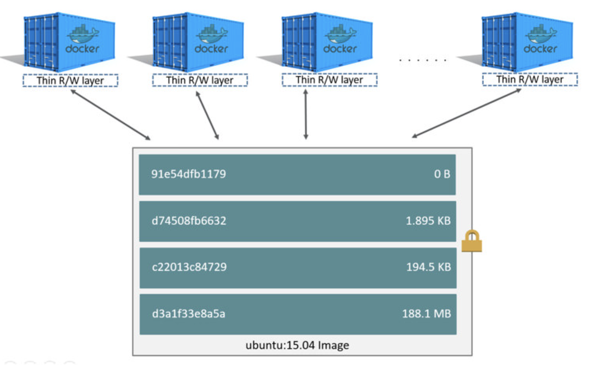
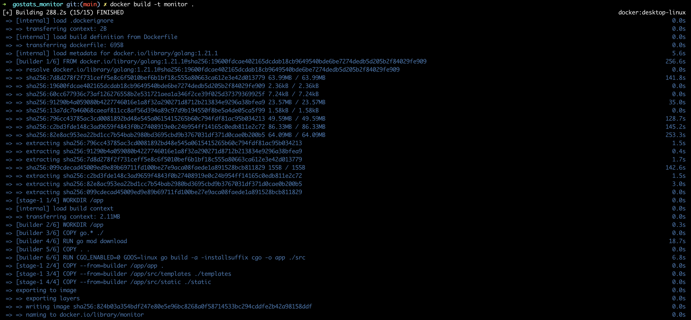
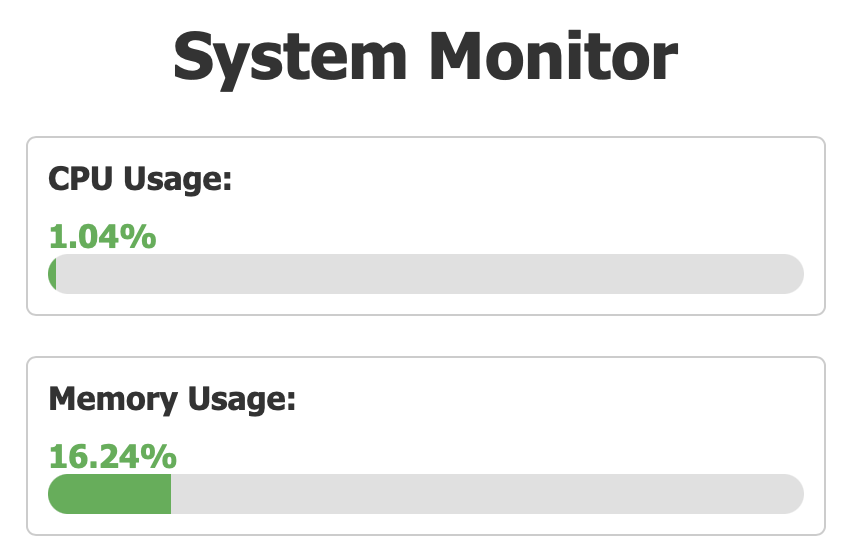

## 🏆 Containers with Docker

🚀 简介

+ 最初编写此内容是为了记录自己学习 Docker 笔记
+ 这些材料内容参考了 jerome Petazzoni 大师和其他 Docker 教学贡献者的视频
+ 按照自己的步调去学习，这里将包含尽可能全的内容

建议：花一些时间阅读 Docker 或者在其他渠道系统学习

## 🌐 目录

[toc]

## 阶段一：

### ⛳️ 学习环境

本地安装 Docker 【99.99% 的docker 都在linux上，推荐使用 远程Linux】

+ 安装 docker【Mac】 ：https://docs.docker.com/desktop/install/mac-install/

```sh
$ docker -v
Docker version 23.0.5, build bc4487a
```

当然也可以 云虚拟机上安装 Docker

如果是linux

+ 登录后，确保您可以运行基本的 Docker 命令：

```sh
$ docker version
Client:
	...
Server:
	...
```

当我们说运行docker 安装docker时，到底是什么意思？

#### 🚀 What is Docker

+ 安装docker 实际上意味着：“安装docker 引擎 和 CLI”
+ Docker 引擎：一个守护进程（在后台运行），负责管理容器【就像 VM的管理程序管理 VM一样】
+ 使用Docker CLI 和 Docker引擎 通过API通信 【还有许多其他程序也通过该API】


### ⛳️ 第一个容器

目标

+ 看到 Docker 的实际应用
+ 启动你的第一个容器

#### 🚀 非常简单的容器

只需运行该命令：

+ 使用了现有的最小、最简单的 image 之一：`busybox`
+ 运行了一个进程并 echo `hello world`

```sh
$ docker run busybox echo hello world
Unable to find image 'busybox:latest' locally
latest: Pulling from library/busybox
29f4353257d6: Pull complete
Digest: sha256:ba76950ac9eaa407512c9d859cea48114eeff8a6f12ebaa5d32ce79d4a017dd8
Status: Downloaded newer image for busybox:latest
hello world
```

如果 Docker 安装是全新的，还会看到一些额外的行，对于镜像的下载`busybox`

再次运行：【不再需要下载】

```sh
$ docker run busybox echo hello world
hello world
```

镜像：

```sh
$ docker images
REPOSITORY   TAG       IMAGE ID       CREATED       SIZE
busybox      latest    23466caa55cb   4 days ago    4.04MB
```


#### 🚀 更有用的容器

运行容器：

```sh
$ sh docker run -it ubuntu
```

+ 运行一个简单的`ubuntu`系统
+ -it`是 的简写`-i -t
  + `-i`告诉 Docker 将我们连接到容器的标准输入。【input / output】
  + `-t`告诉 Docker 我们需要一个伪终端。【terminal】

镜像大小：

```sh
$ docker images
REPOSITORY   TAG       IMAGE ID       CREATED       SIZE
ubuntu       latest    da935f064913   10 days ago   69.3MB
```

尝试在我们的容器中运行`figlet`

```sh
apt-get update
apt-get install figlet
```

一分钟后，`figlet`安装完毕！

```sh
root@792c40d4a504:/# figlet Hello
 _   _      _ _
| | | | ___| | | ___
| |_| |/ _ \ | |/ _ \
|  _  |  __/ | | (_) |
|_| |_|\___|_|_|\___/
```

像平常一样，通过注销 shell 来退出容器。

+ （例如用`^D`或`exit`）

🔔 主机和容器是独立的东西，在主机上安装某些东西不会将其暴露给容器，反之亦然。

+ 可以重复 花时间定制的容器，这不是 Docker 的默认工作流程
+ 如果我们需要在容器中安装某些东西，请构建自定义映像
+ 看起来很复杂其实非常简单【非常强调自动化和可重复性】

🎯 如果我们启动一个新容器并尝试`figlet`？

```sh
$ docker run -it ubuntu
root@b13c164401fb:/# figlet
bash: figlet: command not found
```

+ 启动了一个*全新的容器*。
+ 使用了基本的 Ubuntu 镜像，`figlet`此处不提供。


🚀 VM vs Docker 开发环境

🎯 本地开发环境

当我们使用本地虚拟机（例如 VirtualBox 或 VMware）时，我们的工作流程如下所示：

- 从基本模板创建虚拟机（Ubuntu、CentOS...）
- 安装包，设置环境
- 从事项目工作
- 完成后，关闭虚拟机
- 下次我们需要处理项目时，按照离开时的方式重新启动虚拟机

随着时间的推移，虚拟机配置会不断发展、出现差异，没有一种干净、可靠、确定的方式来提供该环境。


🎯 使用 Docker 进行本地开发

使用 Docker，工作流程如下所示：

- 使用我们的开发环境创建容器镜像
- 使用该镜像运行容器
- 从事项目工作
- 完成后，关闭容器
- 下次我们需要处理项目时，启动一个新容器
- 如果我们需要调整环境，我们创建一个新图像

我们对我们的环境有清晰的定义，并且可以可靠地与他人共享。


### ⛳️ 容器背景

我们的第一个容器是*交互式的*。

我们现在将了解如何：

- 运行非交互式容器。
- 在后台运行容器。
- 列出正在运行的容器。
- 检查容器的日志。
- 停止一个容器。
- 列出已停止的容器

#### 🚀 非交互式容器

我们将运行一个小型自定义容器。【该容器仅显示每秒的时间】

```dockerfile
FROM alpine:latest
CMD ["sh", "-c", "while true; do date; sleep 1; done"]
```

这个容器将永远运行。要停止它，按`^C`

```sh
$ docker run clock
Sat Dec 23 06:34:15 UTC 2023
Sat Dec 23 06:34:16 UTC 2023
```

执行按`^C` 会发生：

`SIGINT`被发送到容器，这意味着：`SIGINT`被发送到 PID 1（默认情况）

- `SIGINT`运行时被发送到*前台进程*`-ti`

但 PID 1 有一个特殊情况：它忽略所有信号！

- 除了`SIGKILL`和`SIGSTOP`
- 除了显式处理的信号

🔔有很多情况`^C`不会停止容器。【docker kill】


#### 🚀 在后台运行容器

容器可以在后台启动，带有`-d`标志（守护进程模式）：

```sh
$ docker run -d clock
4e795afdea6d5d83930bbc3d0109b6dbbf589195069ed30020963a8d55742da8
```

- 我们看不到容器的输出,但Docker 为我们提供了容器的 ID。


#### 🚀 查看容器

`docker ps` 就像Linux `ps`命令一样，使用 列出正在运行的进程。

```sh
$ docker ps
CONTAINER ID   IMAGE     COMMAND                   CREATED              STATUS              PORTS     NAMES
4e795afdea6d   clock     "sh -c 'while true; …"   About a minute ago   Up About a minute             condescending_curran
```

- 容器的ID
- 用于启动容器的镜像
- 容器已经运行 ( `Up`) 几分钟了
- 其他信息（COMMAND、PORTS、NAMES）

🤔 当许多容器已在运行时，仅查看最后启动的容器可能会很有用

+ 这可以通过（“Last”）标志来实现`-l`：

```sh
$ docker ps -l
```


🎯 只查看容器的ID

```sh
docker ps -q
```

+ 列出所有状态的容器的容器ID `-aq`


#### 🚀 容器日志 

Docker 正在记录容器输出

```sh
$ docker logs 4e7
```

- 指定了容器 ID 的*前缀、当然，您可以指定完整的 ID。
- 该`logs`命令将输出容器的 *完整日志。*（有时，这会太多。让我们看看如何解决这个问题。）

为了避免被十一个页面的输出垃圾邮件，我们可以使用以下

+ `--tail`选项
+ `-f`，可以跟踪容器的日志（这将显示日志文件中的最后一行。然后，它将继续实时显示日志）


#### 🚀 停止容器

可以通过两种方式终止分离的容器。

- 使用命令杀死它`docker kill`。【通过使用信号立即停止容器】
- 使用命令停止它`docker stop`。【更优雅。它发送一个`TERM`信号，10秒后，如果容器还没有停止，它发送`KILL.`】

🔔 提醒：该`KILL`信号无法被拦截，会强制终止容器

停止其中一个容器：

+ `stop`命令`kill`可以采用多个容器 ID。

```sh
$ docker stop b9
```

这将需要 10 秒：

- Docker发送TERM信号；
- 容器不会对此信号做出反应（这是一个简单的 Shell 脚本，没有特殊的信号处理）；
- 10秒后，由于容器仍在运行，Docker发送KILL信号；
- 这将终止容器。

```sh
$ docker kill 4e
```

+ 这些容器将立即终止（没有 10 秒的延迟）。


### ⛳️ 了解 Docker 镜像

- 什么是 image。
- 什么是层。

#### 🚀 What is Image?

image = 文件+元数据

- 这些文件构成了我们容器的根文件系统。
- 元数据可以指示很多事情，例如 【作者信息、启动命令、环境变量等等】

镜像由层*组成，从概念上讲，镜像彼此堆叠

- 每层都可以添加、更改和删除文件和/或元数据。
- 可以共享层以优化磁盘使用、传输时间和内存使用。


#### 🚀 镜像层

Java Web 应用程序示例

以下每一项都对应一层：

- CentOS基础OS层
- 由我们本地 IT 添加的包和配置文件
- JRE
- Tomcat
- 应用程序的依赖项
- 应用程序代码和包
- 应用程序配置

（注意：应用程序配置通常由编排工具添加。）

在堆叠层中，我们只能在最上层写入，其他层都是可读的

+ 顶层：读写层
+ 下面的层都是只读


🎯 容器和镜像的区别

- 镜像是只读文件系统。
- 容器是一组封装的进程，在该文件系统的读写副本中运行。
- 为了优化容器启动时间，使用 写时复制 而不是常规复制。
- `docker run`从给定的镜像启动一个容器。

 

🤔 如果镜像是只读的，我们如何更改它？

- 我们不去改变镜像层。
- 我们从该镜像创建一个新容器。
- 然后我们对该容器进行更改。
- 当我们对这些更改感到满意时，我们将它们转换为新层。
- 通过将新图层堆叠在旧镜像之上来创建新镜像。

👀 先有鸡还是先有蛋的问题

- 创建镜像的唯一方法是“冻结”容器。
- 创建容器的唯一方法是实例化镜像。


🎯如何搜索和下载 image 。

+ docker search、dockerhub仓库等等

🤔 image 标签以及何时使用它们 ？

+ 不指定默认：latest

⚠️：请指定标签：投入生产时，确保各处使用相同的版本，以确保以后的可重复性。


#### 🚀 构建镜像概念

`Dockerfile`概述

- `Dockerfile`是 Docker 镜像的构建配方。
- 它包含一系列指令，告诉 Docker 如何构建镜像。
- 该`docker build`命令从`Dockerfile`.

非常简单的案例：

```dockerfile
FROM ubuntu
RUN apt-get update & apt-get install -y figlet
```

- `FROM`表示我们构建的基础镜像。
- 每`RUN`行都将在构建过程中由 Docker 执行。
- 我们的`RUN`命令**必须是非交互式的。**（构建期间无法向 Docker 提供任何输入。）
- 在许多情况下，我们会将`-y`标志添加到`apt-get`.

保存我们的文件，然后执行：

```
$ docker build -t figlet .
```

- `-t`表示要应用于图像的标签。
- `.`*指示构建上下文*的位置。


🤔 再次运行相同的构建，它将是瞬时的。为什么？

- 在每个构建步骤之后，Docker 都会拍摄生成的映像的快照。
- 在执行步骤之前，Docker 检查它是否已经构建了相同的序列。


🎯 sh -c

因为没有自己的解释器，而是需要外包给shell

+ 这称为*exec 语法*

执行某些操作的 Dockerfile 命令可以有两种形式：

- 纯字符串，或*shell 语法*：
  `RUN apt-get install -y figlet`
- JSON 列表，或*exec 语法*：
  `RUN ["apt-get", "install","-y","figlet"]`

Exec 语法指定要执行的*确切*命令。【要求`/bin/sh`存在于容器中】

Shell 语法指定要包装在`/bin/sh -c "..."`.

一般都使用Shell 语法，Exec语法写起来麻烦


#### 🚀 CMD`和`ENTRYPOINT

允许我们设置在容器中运行的默认命令

🎯 使用cmd

我们的新 Dockerfile 将如下所示：

```
FROM ubuntu
RUN apt-get update
RUN ["apt-get", "install", "figlet"]
CMD figlet -f script hello
```

- `CMD`定义在未给出任何命令时运行的默认命令。
- 它可以出现在文件中的任何位置。
- 每一个 `CMD`将取代并覆盖前一个。
- 🎯因此，虽然你可以有多`CMD` ，但它是没有用的。

构建并测试

```sh
$ docker build -t hello .
$ docker run hello
 _          _   _
| |        | | | |
| |     _  | | | |  __
|/ \   |/  |/  |/  /  \_
|   |_/|__/|__/|__/\__/
```

如果我们想要将 shell 放入容器中,只需指定要运行的不同程序：

```sh
➜  devops_notes git:(main) ✗ docker run -ti hello sh
#
```

- 我们指定了`sh`.
- 它取代了 的值`CMD`。


🎯 使用`ENTRYPOINT`

我们的新 Dockerfile 将如下所示：

```dockerfile
FROM ubuntu
RUN apt-get update
RUN ["apt-get", "install", "figlet"]
ENTRYPOINT ["figlet", "-f", "script"]
```

- `ENTRYPOINT`为容器定义基本命令（及其参数）。
- 命令行参数将附加到这些参数中。
- 就像`CMD`,`ENTRYPOINT`可以出现在任何地方，并替换以前的值。

🤔 为什么我们使用 JSON 语法`ENTRYPOINT`？

- 当 CMD 或 ENTRYPOINT 使用字符串语法时，它们会被包装在`sh -c`.
- 为了避免这种包装，我们可以使用 JSON 语法。

如果我们使用`ENTRYPOINT`字符串语法怎么办：这将在图像中运行以下命令`figlet`：

```sh
sh -c "figlet -f script" Hello
```

构建并测试

```sh
➜  devops_notes git:(main) ✗ docker run hello "HELLO DOCKER"
 ,      ___    _      _    __      ____    __    ___  ,      ___  , __
/|   | / (_)\_|_)  \_|_)  /\_\/   (|   \  /\_\/ / (_)/|   / / (_)/|/  \
 |___| \__    |      |   |    |    |    ||    ||      |__/  \__   |___/
 |   |\/     _|     _|   |    |   _|    ||    ||      | \   /     | \
 |   |/\___/(/\___/(/\___/\__/   (/\___/  \__/  \___/ |  \_/\___/ |  \_/
```


🎯 `CMD`和`ENTRYPOINT`一起使用

如果我们想为容器定义默认参数怎么办？将一起使用`ENTRYPOINT`和`CMD`。

- `ENTRYPOINT`将为我们的容器定义基本命令。
- `CMD`将定义该命令的默认参数。
- 它们*都*必须使用 JSON 语法。

我们的新 Dockerfile 将如下所示：

```dockerfile
FROM ubuntu
RUN apt-get update
RUN ["apt-get", "install", "figlet"]
ENTRYPOINT ["figlet", "-f", "script"]
CMD ["hello world"]
```

- `ENTRYPOINT`为容器定义基本命令（及其参数）。
- 如果我们在启动容器时没有指定额外的命令行参数，`CMD`则会附加 的值。
- 否则，将使用我们额外的命令行参数而不是`CMD`.


🧡 回顾

- `ocker run myimage`执行`ENTRYPOINT`+`CMD`
- `docker run myimage args`执行`ENTRYPOINT`+ `args`（覆盖`CMD`）
- `docker run --entrypoint prog myimage`执行`prog`（覆盖两者）


🎯何时使用`ENTRYPOINT`vs`CMD`

`ENTRYPOINT`非常适合“容器化二进制文件”。

例子：`docker run consul --help`（假装该`docker run`部分不存在！）

`CMD`非常适合具有多个二进制文件的图像。

例子：`docker run busybox ifconfig`（表明我们要运行*哪个程序是有意义的！*）


###  ⛳️在构建期间复制文件

Dockerfile 关键字：`COPY`.

- 我们可以`COPY`递归地遍历整个目录

- 可以这样做，例如`COPY . .`

  （但可能需要一些额外的预防措施以避免复制太多）

- 在较旧的 Dockerfile 中，您可能会看到以下`ADD`命令；认为它已弃用

  （类似`COPY`但可以自动提取档案）

我们可以创建一个名为`.dockerignore`

（在构建上下文的顶层）

- 它可以包含要忽略的文件名和全局变量

- 它们不会被发送给建筑商

  （并且不会最终出现在结果图像中）

有关小细节请参阅[文档](https://docs.docker.com/engine/reference/builder/#dockerignore-file)


###  ⛳️ 构建镜像实验

1. 交互式：修改容器内容后使用docker commit
   + 手动过程=糟糕。
2. DockerFIle
   + 自动化流程=好。

🎉 使用 Dockerfile 构建 Docker 镜像

使用项目：[监控主机CPU内存使用率](https://gitlab.com/baimiyishu13/my_devops_notes/-/tree/main/codes/gostats_monitor?ref_type=heads)

+ 语言：Go
+ 端口：5050
+ 登陆密码：admin、admin

DockerFile文件：【多阶段构建】

```dockerfile
# 阶段1: 构建Go应用
FROM golang:1.21.1 AS builder

# 在容器中设置工作目录
WORKDIR /app

# 复制Go模块文件
COPY go.* ./

# 下载和安装依赖
RUN go mod download

# 复制整个应用程序
COPY . .

# 构建Go应用程序
RUN CGO_ENABLED=0 GOOS=linux go build -a -installsuffix cgo -o app ./src

# 阶段2: 创建最终轻量级镜像
FROM scratch

# 在容器中设置工作目录
WORKDIR /app

# 从第一个阶段复制二进制文件
COPY --from=builder /app/app .
COPY --from=builder /app/src/templates ./templates
COPY --from=builder /app/src/static ./static

# 暴露端口
EXPOSE 5050

# 运行可执行文件
CMD ["./app"]
```

构建镜像：



docker镜像

```sh
➜  gostats_monitor git:(main) ✗ docker images
REPOSITORY   TAG       IMAGE ID       CREATED          SIZE
monitor      latest    824b03a354bd   12 minutes ago   16.7MB
```

查看历史记录【镜像】

```sh
➜  gostats_monitor git:(main) ✗ docker history monitor
IMAGE          CREATED          CREATED BY                                       SIZE      COMMENT
824b03a354bd   30 minutes ago   CMD ["./app"]                                    0B        buildkit.dockerfile.v0
<missing>      30 minutes ago   EXPOSE map[5050/tcp:{}]                          0B        buildkit.dockerfile.v0
<missing>      30 minutes ago   COPY /app/src/static ./static # buildkit         2.09MB    buildkit.dockerfile.v0
<missing>      30 minutes ago   COPY /app/src/templates ./templates # buildk…   1.56kB    buildkit.dockerfile.v0
<missing>      30 minutes ago   COPY /app/app . # buildkit                       14.6MB    buildkit.dockerfile.v0
<missing>      35 minutes ago   WORKDIR /app                                     0B        buildkit.dockerfile.v0
```

运行docker镜像

```sh
➜  ~ docker run -ti -d -p 5050:5050 --name mac_monitor monitor
7d3271229b57417fb16dc60fc83073dc4e8bb720c9bf53f1189cce622904f25d
➜  ~ docker ps
CONTAINER ID   IMAGE     COMMAND   CREATED         STATUS         PORTS                    NAMES
7d3271229b57   monitor   "./app"   4 seconds ago   Up 3 seconds   0.0.0.0:5050->5050/tcp   mac_monitor
```

本地登陆访问

 


---


## 阶段二：

- [容器网络基础知识](https://2022-11-live.container.training/docker.yml.html#toc-container-networking-basics)
- [使用 Docker 进行本地开发工作流程](https://2022-11-live.container.training/docker.yml.html#toc-local-development-workflow-with-docker)
- [容器网络模型](https://2022-11-live.container.training/docker.yml.html#toc-the-container-network-model)
- [使用容器发现服务](https://2022-11-live.container.training/docker.yml.html#toc-service-discovery-with-containers)
- [为开发堆栈编写](https://2022-11-live.container.training/docker.yml.html#toc-compose-for-development-stacks)
- [练习 — 编写 Compose 文件](https://2022-11-live.container.training/docker.yml.html#toc-exercise--writing-a-compose-file)

### ⛳️ 容器网络基础知识

目标

现在将在容器中运行网络服务（接受请求）。

- 在容器中运行网络服务。
- 连接到该网络服务。
- 查找容器的 IP 地址。


