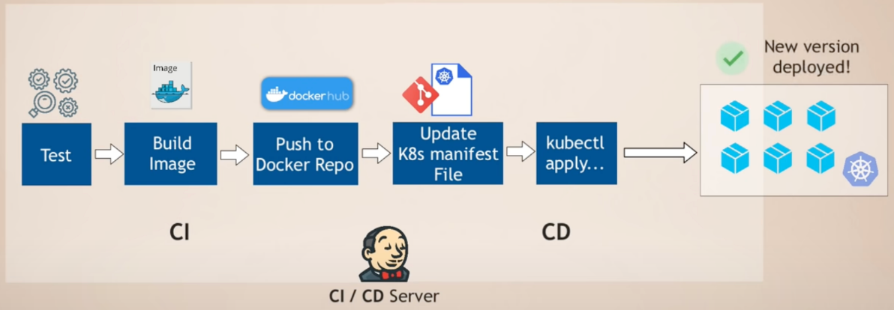
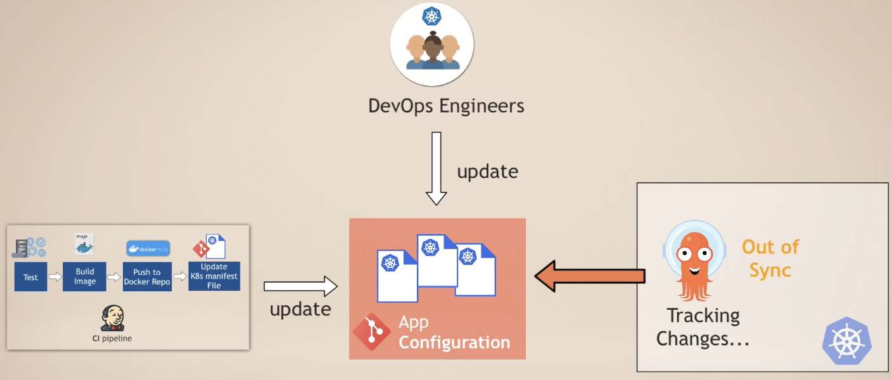
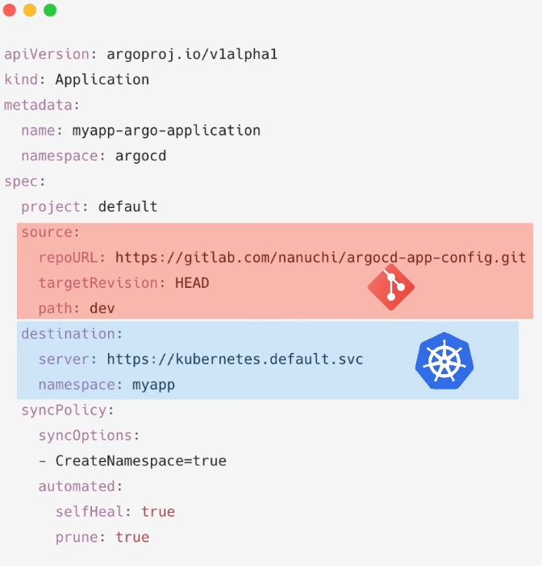

### Argo CD 简介：Kubernetes DevOps CI/CD

##### 什么是 ArgoCD？

+ 持续交付工具：Argo cd 理解为CD工具或持续交付的工具

不使用 ArgoCD 的 CD 工作流程：

例如：微服务部署在k8s集群，现在代码发生改变【新功能、BUG等等】

+ jenkins上的 ci 管道自动触发，并测试更改，构建新的 dokcer 镜像，推送到仓库

🤔 新镜像如何部署到集群

+ 到集群使用新的 yaml 文件

这些步骤是ci 管道的延续，因此推送到仓库后：

+ jenkins 将更新应用程序的 yaml 文件
+ 使用 类似 kubectl 工具将部署文件应用到 kubernetes 

 

存在的挑战：

1. 需要安装和设置诸如 kubectl 或 helm 等工具来访问 Kubernetes 集群，并对这些构建自动化的工具执行更改 【需要在jenkins上安装和配置它们】
2. 配置访问 k8s 集群，如果是在云上集群，还需要配置访问云访问凭据 【配置工作、安全问题】
3. 部署状态没有进一步的可见性，【部署后的状态和可用性】只能通过下一步的测试步骤找到这一点

使用 ArgoCD 的 CD 工作流程

+ Argo cd 是针对这个特定的用例构建的，可以持续交付到kubernetes 集群

Argo cd 使得cd流程更加高效并解决使用jenkins存在的挑战

+ 并不会像 jenkins 这样的cicd工具 外部访问集群 

不会将更改推送到集群，而是使用 pull 在集群中的代理 即 argo cd

+ 在集群中部署 argo cd、配置argo cd 连接到 git 存储库 并且开始监听任何更改，则会自动拉取这些更改并应用到集群中

最后的流程：

1. 开发提交代码
2. ci jenkins 自动启动构建过程 【并且测试更改构建镜像】 - 推送仓库 - 【最后：更新 yaml 文件】⚠️ 最佳实践是应用程序代码和部署代码放置在不同存储库

如果不希望运行整个 ci 管道，因为代码本身并没有改变，也不希望在构建管道中有很复杂的逻辑

  

最终拥有单独的 CI 和 CD 管道

+ CI 管道 主要由开发人员拥有，并在 Jenkins 上配置
+ CD 管道由 DevOps 团队进行配置

这种方式仍然可以拥有自动化的 CI CD 管道【不同团队负责不同的部分】

argo cd 支持：

+ 纯 yaml文件
+ Helm

将 Git 与 ArgoCD 结合使用的好处

1. 整个 k8s 配置定义为 git 存储库中的代码 【不必再从笔记本电脑上执行操作并执行脚本 - kubectl helm install 等等】，使用相同的界面在集群中进行任何更改
2. 手动更新k8s上资源，【argo cd 会同时监视 git 和 k8s中的更改】同步更改
   + 可以配置为 不自动覆盖 和  撤销哪些手动集群更改，而是发送一个警报，说明集群中的某些内容被更改
   + 而不是无法跟踪的 kubectl apply命令 【记录每一个更改，以版本控制的方式】

3. 轻松回滚：更改出现问题 或者新的应用程序无法正常工作。只需返回上一个版本【避免了手动恢复】
4. 集群灾难恢复 ：集群a奔溃，可以创建一个新集群B指定到新集群

用 Git 和 ArgoCD 进行 K8s 访问控制

+ 团队成员可以发起和剔除更改集群的任何请求，然后只有少数的 高级工程师可以批准和合并
+ 从而不是直接访问集群

间接提供了一种通过git 管理集群全新

ArgoCD 作为Kubernetes 扩展

配置 ArgoCD

+ crd 自定义资源扩展了 k8s api，允许使用 yaml 文件配置 argo cd 的定义

  

一个argo cd 也可以同时负责多个集群

 [0:45](https://www.youtube.com/watch?v=MeU5_k9ssrs&t=45s) - 什么是 ArgoCD [1:29](https://www.youtube.com/watch?v=MeU5_k9ssrs&t=89s) - 不使用 ArgoCD 的 CD 工作流程 [4:48](https://www.youtube.com/watch?v=MeU5_k9ssrs&t=288s) -  [9:34](https://www.youtube.com/watch?v=MeU5_k9ssrs&t=574s) - 将 GitOps 与 ArgoCD 结合使用的好处    [9:41](https://www.youtube.com/watch?v=MeU5_k9ssrs&t=581s) - Git 作为单一事实来源    [13:20](https://www.youtube.com/watch?v=MeU5_k9ssrs&t=800s) - 轻松回滚    [14:08](https://www.youtube.com/watch?v=MeU5_k9ssrs&t=848s) - 集群灾难恢复 [15:10](https://www.youtube.com/watch?v=MeU5_k9ssrs&t=910s) - 使用 Git 和 ArgoCD 进行 K8s 访问控制 [16:52](https://www.youtube.com/watch?v=MeU5_k9ssrs&t=1012s) - ArgoCD 作为Kubernetes 扩展 [18:49](https://www.youtube.com/watch?v=MeU5_k9ssrs&t=1129s) - 如何配置 ArgoCD？ [20:08](https://www.youtube.com/watch?v=MeU5_k9ssrs&t=1208s) - 使用 ArgoCD 实现多个集群 [23:24](https://www.youtube.com/watch?v=MeU5_k9ssrs&t=1404s) - 替代其他 CI/CD 工具？ [24:45](https://www.youtube.com/watch?v=MeU5_k9ssrs&t=1485s) - 演示设置和概述 [27:42](https://www.youtube.com/watch?v=MeU5_k9ssrs&t=1662s) - 动手演示开始