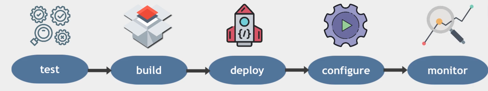

🍄 完整的DevOps

---

目标：完全建立一个DevOps管道，知道所有的DevOps概念

 

1. 奠定坚实的基础理论知识，理解所有概念
2. 有用的动手实践能力
3. 持续集成、持续交付

### 角色及其职位

---

角色的每一个如何融入整个软件开发和维护生命周期，实际上经历了它们其中的每一个，从而塑造整体形象，整个过程实际上是如何运作的

如何契合，形成整体循环♻️

一个APP为例：

1. 开发团队：软件和应用程序的开发【每个功能可能有多个部门】
2. 测试团队：一旦软件开发完成，测试应用程序 【测试代码、手动测试功能、新功能测试等】
3. 运维团队：发布应用程序，必须构建应用程序，打包然后在服务器上运行

需要完全不同的技术知识 和 完全不同的工具🔧：

| 软件开发 | 运维                  |
| -------- | --------------------- |
| 编程语言 | 操作系统 OS           |
| 测试框架 | Linux 命令行工具      |
| 数据库   | 脚本 - 编写自动化脚本 |
| 版本控制 | 监控工具              |

完全不同的技能和诀窍，但是在工作中又必须相互交流。

### Linux 模块

---

🎯 弥补填充知识空白

1. 虚拟化
2. Linux文件系统、结构，主要的Linux命令
3. 软件管理
4. vim
5. 用户和权限
6. Shell 脚本
7. 环境变量
8. 网路知识
9. ssh

操作系统的任务：负责分配和管理硬件资源【 CPU、内村、存储、IO设备】

操作系统的构建和组成：

1. 内核：管理硬件组织，处理IO设备
2. 应用程序：操作系统
3. 用户程序

#### 🧬 虚拟化

一个非常重要的概念

1. 虚拟机是什么？
2.  为什么他们如此有用
3. 虚拟机如何工作

在物理机的应用程序 安装虚拟化软件，不需要单独的硬件安装操作系统

做到这一层的被称为：

+ Hypervisor：允许在物理机上托管多种操作系统，告诉物理机需要使用一些物理资源区创建：
  + 虚拟CPU
  + 虚拟内存
  + 虚拟存储

⚠️ 只能给虚拟机实际的硬件资源

⚠️ 虚拟机完全孤立的，虚拟机本身认为它是一台独立的计算机，也不知道是托管在物理机上的

+ 虚拟机出现问题，不会影响其他虚拟机和主操作系统

‼️ 在企业服务器，直接在主机操作系统上安装 Hypervisor 而不像我们实验哪样，它直接位于硬件之上

1. VMware
2. Hyper-v

#### 🗂️ Linux文件系统

---

+ 